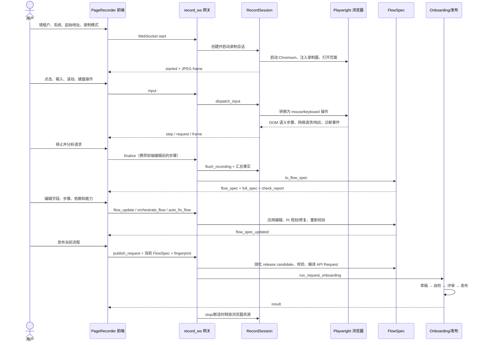

# Dano 网页录制完整逻辑

> 本文依据当前仓库实现整理，描述从用户点击“开始录制”到 Skill 发布、会话释放的完整链路。
>
> 当前实现的核心不是把鼠标坐标录成回放脚本，而是：**托管浏览器采集页面语义动作与全量网络事实，生成可编辑 FlowSpec，经能力编排、校验和发布闸门后，编译成可执行的请求型 Skill。**

## 1. 范围与关键结论

录制链路涉及以下主要文件：

| 层 | 文件 | 职责 |
|---|---|---|
| 前端入口 | `skillfrontend/src/pages/Recording.tsx` | 读取租户、子系统、地址和登录态，挂载录制组件 |
| 前端工作台 | `skillfrontend/src/components/PageRecorder.tsx` | 建立 WebSocket、显示浏览器画面、转发输入、展示步骤、编辑 FlowSpec、触发发布 |
| WebSocket 网关 | `back/dano/gateway/app.py` 中 `record_ws` | 管理录制会话、消息协议、FlowSpec 状态和发布流程 |
| 浏览器录制器 | `back/dano/execution/page/recorder.py` | 启动 Playwright、注入 DOM 录制脚本、截屏、输入回传、请求/响应/诊断采集 |
| 请求分析 | `back/dano/execution/page/request_capture.py` | 请求分类、提交候选选择、请求体参数化、选项/身份/成功规则识别和运行期请求执行 |
| 流程建模 | `back/dano/execution/page/flow_spec.py` | RequestFacts、步骤、字段、依赖、能力、PI 闭环、校验、发布快照和 API 请求编译 |
| 接入发布 | `back/dano/onboarding/page_onboard.py` | 草稿、自检、评审、发布资产和验证状态判定 |

当前实现有三个事实层：

1. **RequestFacts**：录制期捕获的原始请求、响应、顺序、页面/Frame 归属和诊断信息，是底层事实源。
2. **FlowSpec**：由请求事实推导并允许用户编辑的流程契约，是工作台和发布的唯一入口。
3. **API Request / PageScriptBody**：由当前 FlowSpec 编译出的运行期资产，不允许发布阶段静默重新规划。

页面语义步骤 `fill/select/pick/click/submit` 用于保存用户操作证据、表单样例、必填信息和页面枚举；真正发布的执行流程以 FlowSpec 中物化的网络请求步骤为准。

## 2. 总体时序



## 3. 阶段一：前端准备与建立会话

### 3.1 用户输入

录制页向 `PageRecorder` 提供：

- `tenant`：租户；未选择租户时不能开始。
- `subsystem`：目标子系统。
- `startUrl`：录制起始页面；不能为空。
- `baseUrl`：当 `startUrl` 是相对路径时用于拼接完整地址。
- `storageState`：可选的 Playwright 登录态。
- `recordingMode`：`real_submit` 或 `record_only`。

前端模式和后端模式映射如下：

| 前端值 | `start.intercept` | 后端记录值 | 行为 |
|---|---:|---|---|
| `real_submit` | `false` | `real_submit` | 请求按页面原逻辑真实发送，录制器旁观采集 |
| `record_only` | `true` | `intercepted_submit` | 业务写请求被捕获并伪造成功响应，不产生真实业务记录 |

### 3.2 WebSocket 首帧

前端连接：

```text
WS /onboarding/page/record
```

连接成功后的首帧必须是：

```json
{
  "type": "start",
  "tenant": "租户标识",
  "subsystem": "子系统标识",
  "start_url": "目标页面地址",
  "base_url": "可选基址",
  "storage_state": "可选登录态",
  "intercept": false
}
```

后端拒绝缺少 `type=start` 或 `start_url` 的连接，并返回 `error`。

### 3.3 前端状态初始化

开始录制前，前端清空：

- 旧画面和帧序号；
- 语义步骤和请求列表；
- 字段、候选请求、选项绑定、身份绑定；
- FlowSpec、校验报告、JSON 草稿、依赖和能力编辑状态；
- 上次发布结果。

WebSocket 打开后发送 `start`；收到 `started` 后进入 `recording` 状态。连接关闭时，如果正在录制或发布，状态回到 `idle`。

## 4. 阶段二：后端启动托管浏览器

`record_ws` 创建 `RecordSession`，并注入两个实时回调：

- `on_step`：向前端发送 `{type: "step", step: ...}`；
- `on_request`：向前端发送 `{type: "request", request: ...}`。

随后 `RecordSession.start()` 完成：

1. 启动 Playwright 和无头 Chromium。
2. 创建固定视口 `1280 × 800` 的 BrowserContext。
3. 按配置决定是否忽略 HTTPS 证书错误。
4. 如有 `storage_state`，在创建 Context 时恢复 cookie 和 localStorage。
5. 如有 token，则通过认证适配器预置登录态。
6. 使用 `add_init_script` 向每个页面注入 `_RECORDER_JS`。
7. 暴露 `window.__danoRecord`，把页面事件传回 Python。
8. 根据录制模式挂载请求路由或旁观监听。
9. 挂载响应捕获、新页面跟随和诊断监听。
10. 打开起始页面，等待 `domcontentloaded`，避免被 SPA 长连接阻塞。

BrowserContext 级别的注入、路由和响应监听会覆盖后续打开的新标签页或弹窗。新页面出现后会成为活动页，截屏也切换过去；活动页关闭时会退回仍然打开的最后一个页面。

## 5. 阶段三：截屏与远程输入

### 5.1 截屏流

录制器通过 CDP `Page.startScreencast` 输出 JPEG：

- 最大画面 `1024 × 640`；
- JPEG 质量 50；
- 用户近期有输入、导航、网络或录制事件时最高约 20 FPS；
- 空闲时约 6 FPS；
- 每帧带递增 `seq`，前端只渲染最新且序号更大的帧。

后端消息：

```json
{
  "type": "frame",
  "seq": 123,
  "data": "base64-jpeg"
}
```

前端使用 `requestAnimationFrame` 合并快速到达的帧，避免重复渲染旧画面。

### 5.2 输入回传

前端把画面点击位置转换为 0～1 的归一化坐标：

```json
{"type":"input","event":{"kind":"click","nx":0.42,"ny":0.63}}
```

后端再乘以浏览器视口尺寸，调用 Playwright：

| `kind` | 后端行为 |
|---|---|
| `click` | `page.mouse.click()` |
| `dblclick` | `page.mouse.dblclick()` |
| `text` | `page.keyboard.insert_text()`，支持中文输入 |
| `key` | 通过安全白名单后调用 `page.keyboard.press()` |
| `scroll` | `page.mouse.wheel()` |

键盘白名单只允许导航、编辑和有限组合键，例如 Enter、Tab、方向键、退格、Delete、Ctrl/Meta+A/Z/Y；拒绝 Alt 组合和任意未授权快捷键。

## 6. 阶段四：DOM 语义动作录制

注入脚本不保存鼠标坐标，而是尽量生成稳定的语义定位器。

### 6.1 定位器优先级

表单字段：

1. 关联 `label`；
2. `placeholder`；
3. ARIA 名称；
4. `name`；
5. 稳定 `id`。

可点击元素：

1. `data-testid` 等测试属性；
2. `role + accessible name`；
3. 可见文本；
4. 稳定 `id`。

最终形成类似：

```text
label=请假类型
placeholder=请输入原因
role=button[name=提交]
css=[name="approverId"]
```

### 6.2 动作类型

| `op` | 来源 | 说明 |
|---|---|---|
| `fill` | input/textarea 的 input、change、blur | 300ms 防抖，保存最终值 |
| `select` | 原生 `<select>` | 同时保存所有 option 的 label/value |
| `pick` | 自定义下拉、日期、级联等 | 保存触发字段、最终显示值和弹层可见选项 |
| `upload` | file input | 记录上传动作，但 multipart 请求不会被拦截 |
| `click` | 普通按钮、链接、菜单或可点击卡片 | 排除输入框聚焦噪声 |
| `submit` | 命中提交/保存/确认等语义的按钮 | 标记提交动作 |

### 6.3 去重与字段键

- 页面端对同一字段的连续输入做 300ms 防抖。
- Python 端对同一 `locator + page_id + frame_id` 的连续 `fill/select/pick` 只保留最后一次。
- 前端对连续同 locator、同 op 的 `fill/select/pick/click` 也覆盖最后一步；`submit` 不覆盖。
- 字段键按“标准字段语义 + locator + page + frame”稳定分配。
- 同名不同控件会生成 `字段`、`字段#2`，避免样例、必填和枚举错位。

### 6.4 登录和敏感值

- URL 命中 `/login`、`/signin`、`/sso` 等登录页时，页面动作不进入业务步骤。
- 密码框、信用卡、CVC、有效期、银行账号等敏感输入不录值。
- 前端可在登录后点击“从这里开始录”，发送 `reset`，清空登录阶段步骤、请求、响应和诊断。

### 6.5 必填和页面枚举

必填证据来自原生 `required`、`aria-required`、表单项 required class 或标签中的 `*`。

页面枚举优先读取弹层中当前真实可见选项：

- 优先标准 ARIA option/menu/tree 结构；
- 兼容 Element、Ant Design、Vant、Material、Blueprint、Vuetify、Quasar 等常见组件；
- 最多保留 500 个可见候选；
- 原生 select 保存明确的 label/value；
- 自定义控件只有在 DOM 暴露 `data-value/value/data-id` 等属性时才保存真实 value；不会把 label 伪装成 value。

## 7. 阶段五：网络事实采集

### 7.1 三份数据

`RecordSession` 同时维护：

| 集合 | 内容 | 用途 |
|---|---|---|
| `all_requests` | 所有 GET/POST/PUT/PATCH/DELETE 请求及响应 | RequestFacts 和依赖闭包的底层事实 |
| `requests` | 捕获到的写请求 | 提交候选、参数化和多步工作流 |
| `reads` | 返回列表型 JSON 的读请求 | 下拉、选人、字典和事实核查候选源 |

每条全量请求包含：

```text
index/request_id/sequence/page_id/frame_id
method/url/query/headers/content_type/post_data
response_json/status/timestamp
role/keep/reason/confidence
```

请求先完整落库，再分类；不能因为初次判断为噪声就丢失事实。响应回来后会精确按请求实例贴回，并重新分类。

### 7.2 两种请求处理模式

#### 真实提交模式

BrowserContext 监听所有请求：请求照常发送；写请求旁观捕获，响应随后贴回事实记录。

#### 只录制不提交模式

BrowserContext 路由所有请求：

- GET、登录/鉴权写、查询型 POST 正常放行；
- multipart 上传正常放行，避免文件丢失；
- 有请求体的普通业务写请求被捕获，不发给目标服务；
- 后端返回伪造的 HTTP 200 JSON 成功包，使前端流程能够继续。

伪成功包优先从已捕获成功读响应推断当前系统的成功字段和值；推断不到时提供包含 `success/ok/status/code/data` 的通用结构。

### 7.3 请求角色

请求会被归为诸如：

- `submit_anchor` / `business_write`：业务提交或写操作；
- `business_get`：业务记录/状态查询；
- `read_context`：流程上下文或前置查询；
- `read_option`：下拉、字典、人员等选项源；
- `auth`：登录鉴权；
- `noise`：静态资源、埋点、心跳等噪声。

分类结果带 `keep/reason/confidence`，响应落地后可重新计算。

### 7.4 诊断事实

录制器采集：

- `console`；
- `pageerror`；
- `requestfailed`。

每条诊断统一带时间戳，消息最长 2000 字；失败请求尽量关联对应 `request_index`。前端自身的 error/unhandledrejection 也每 5 秒批量上传一次，单次最多 50 条。

## 8. 阶段六：停止并分析（finalize）

用户点击“停止并分析请求”后，前端发送：

```json
{
  "type": "finalize",
  "action": "英文动作名",
  "title": "标题",
  "steps": []
}
```

动作名必须符合：

```regex
^[a-zA-Z][a-zA-Z0-9_]*$
```

后端依次执行：

1. `flush_recording()`，强制提交页面端尚在防抖中的最后一次输入。
2. 如果前端传回编辑后的步骤，以前端版本为准；同时把 flush 新增的尾部 fill/select/pick 合并进去。
3. 从步骤生成 `samples`、`required_labels`、`page_enum_options`。
4. 获取当前 BrowserContext 的 `storage_state`。
5. 获取全量请求、写请求候选、列表读响应和诊断事实。
6. 排除无请求体写请求以及登录/鉴权写请求。
7. 自动选择最像提交的候选；如有多个，前端可发送 `choose_request` 改选。
8. 调用 `to_flow_spec()` 生成工作台初版。

分支行为：

- **完全没有捕获到请求**：返回失败结果，提示在拦截模式下重新点击一次提交。
- **存在 JSON 写请求**：发送字段建议 `request_fields`，并生成完整 FlowSpec。
- **没有 JSON 写请求但存在业务 GET/读请求**：仍生成 RequestGraph/GET FlowSpec，允许发布查询或选项能力。

## 9. 阶段七：从请求事实生成 FlowSpec

### 9.1 FlowSpec 主结构

```text
FlowSpec
├── tenant / subsystem / title / business_description
├── recording_mode / diagnostics / risk_level
├── request_facts
│   ├── requests        原始请求事实
│   ├── analysis        可重算角色和置信度
│   ├── usage           请求被步骤/能力使用的索引
│   └── option_sources  页面枚举等选项证据
├── steps               可执行 HTTP 步骤
├── links               上游响应 → 下游请求字段
├── capabilities        对外可调用的业务能力
├── capability_relations
├── review_items
├── goal
└── meta                RequestGraph、版本、指纹、PI 历史等
```

### 9.2 请求选择和物化

`to_flow_spec()` 的主要过程：

1. 合并显式 reads 与全量请求中的读响应。
2. 为每条请求计算角色。
3. 找出写候选和业务 GET/上下文前置候选。
4. 对重复前置读请求保留信息最完整的一条。
5. 自动选择提交写步骤；没有写请求时保留高置信业务 GET。
6. 从目标写步骤向前寻找依赖闭包，把真正提供流程上下文的 GET 一起物化。
7. 为选中请求建立 RequestGraph，并区分 selected/candidate/filtered。
8. 把每条选中请求转换为 `FlowStep`。
9. 从上游响应值与下游请求字段的真实值匹配中发现 `FlowLink`。
10. 仅在来源唯一且证据足够强时自动确认链接；其余链接需要人工确认。
11. 推断整体风险、事实核查、标题、运行期计算字段和 RecordedGoal。
12. 生成初始版本记录 `action=recorded` 并刷新 review items。

### 9.3 字段契约

每个 `ParamField` 除 path/key/value/type/required 外，还包含：

- `category`：`user_param`、`runtime_var`、`system_const`；
- `source_kind`：用户输入、上游响应、当前用户、系统时间、请求头、页面上下文、接口选项、页面枚举、常量等；
- `source`：具体来源配置；
- `enum_options` / `enum_value_map`：显示值与真实提交值；
- `exposed_to_user`：是否暴露给调用方；
- `reason/confidence/evidence`：推断理由和证据；
- `need_human_confirm/locked`：人工确认和锁定状态。

字段的关键原则：

- 录制时用户真实填写的业务值优先成为用户参数。
- token、当前登录人、时间、taskId/draftId 等不能冻结为录制旧值。
- 流程定义、表单类型等稳定配置可作为系统常量。
- 内部 ID/短码不能直接暴露给用户，必须绑定接口选项、枚举映射或系统来源。
- 枚举必须覆盖录制时的真实提交值，不能只有显示名或只有短码。

### 9.4 Capability 层

Capability 是调用方看到的业务动作，FlowStep 是底层真实接口执行。典型种类：

- `query_status`；
- `list_options`；
- `validate_batch`；
- `submit_batch`；
- `submit`。

Capability 记录请求成员、输入/内部/计算/输出字段、依赖、执行节点、输入输出 Schema、前置条件、置信度、确认状态以及调用方和 Skill 各自职责。

## 10. 阶段八：工作台编辑和 PI 闭环

前端收到：

```json
{
  "type": "flow_spec",
  "flow_spec": "摘要",
  "full_spec": "可编辑完整版本",
  "check_report": "实时校验结果"
}
```

所有编辑都回到后端的 `pending_flow_spec`，该对象是当前 WebSocket 会话内的权威版本。

### 10.1 编辑消息

| 消息 | 作用 |
|---|---|
| `flow_update` | 应用结构化 edits：字段、步骤、链接、能力、顺序、review 状态等 |
| `flow_replace` | 用前端 JSON 整体替换，并追加版本记录 |
| `refresh_flow_spec` | 当前后端权威版本重新下发 |
| `choose_request` | 改选写请求并重建 FlowSpec |
| `step_naming` | 用语义模型生成业务步骤名 |
| `business_description` | 生成结构化业务说明 |
| `orchestrate_flow` | 运行 PI `plan` 模式，生成或优化能力 |
| `auto_fix_flow` | 运行 PI `repair` 模式，修复可修复问题 |

客户端显示的 FlowSpec 会脱敏认证头、身份值、选项源认证信息和响应中的敏感字段。客户端回传时，后端会从当前权威版本恢复被遮蔽的 body、headers、identity 和 select source 信息，防止脱敏值覆盖真实执行配置。

### 10.2 乐观更新与冲突处理

- 前端可以先乐观更新界面。
- 后端每次应用编辑后返回 `flow_spec_updated + check_report`。
- 编辑失败时后端连同 `full_spec` 返回 `error`，前端恢复权威版本。
- 遇到 `step not found` 或 `link not found`，前端自动发送 `refresh_flow_spec`。
- FlowSpec 每次下发带 `meta.current_fingerprint`，发布时用于乐观并发控制。

### 10.3 PI 闭环

`run_recording_pi_loop()` 明确区分首次完整生成和后续增量补强。是否首次以
`meta.capability_generation.initial_completed + fact_hash` 为准，不再只看当前是否已有 capability：

```text
稳定录制事实
  → 首次完整 semantic_plan（业务、接口角色、字段、能力、关系）
  → 编译为白名单 FlowEdits
  → Validator
  → 同一上下文追加校验差量并受限 Repair
  → 再验证
  → 通过、没有变化或达到轮次上限后停止

后续点击
  → 继承已接受 semantic_plan
  → 锁定能力身份/类型/接口成员
  → 只补字段、依赖、节点、Schema 与返回映射
```

约束：

- 默认最多 4 轮，单次模型调用有超时。
- 首次 `plan` 必须覆盖全部已物化接口和全部调用方字段；模型不可用时保留确定性结果并标记 `degraded_deterministic`，不伪装成完整语义生成。
- 后续 `plan` 是增量优化；旧工作台自动迁移为该模式，不重开首次边界。
- `repair` 处理错误、警告、review items 和可自动修复问题。
- Repair 不允许偷偷扩张请求范围或改变人工确认的作用域。
- 模型输出先应用到副本；新增错误、Wire 合同变化、dry-run 退化或增量能力范围变化会整轮回滚。
- 能力输入输出、请求成员和依赖会在每轮后重新同步。
- 可确定性确认的 ready capability 会自动确认并生成确认哈希。
- 同一 PI run 使用稳定消息前缀和追加式校验差量；完全相同的重复优化直接命中工作台结果缓存，不再请求模型。
- PI 历史写入 `meta.recording_pi_loop`，并追加 FlowSpec 版本。

## 11. 阶段九：发布前校验

用户必须先生成至少一个 Capability。发布按钮发送：

```json
{
  "type": "publish_request",
  "action": "动作名",
  "title": "标题",
  "flow_spec": {},
  "expected_fingerprint": "前端看到的当前指纹",
  "use_flow_spec": true
}
```

发布阶段遵循一个重要约束：**只规范化、校验并编译用户当前确认的工作台版本，不自动调用 Planner 或 Repair，不恢复用户删除的步骤，不静默改写字段。**

### 11.1 指纹冲突

后端比较 `expected_fingerprint` 与当前 `pending_flow_spec` 指纹。不同则返回：

- `stage=flow_spec_conflict`；
- 当前指纹；
- 最新 `full_spec`。

用户必须使用最新版本重新发布。

前端对 `flow_update/flow_replace` 使用单请求串行队列；后端按 `operation_id` 幂等处理并回传最新指纹。
发布、生成或修复会先等待队列清空，因此不会再用最后一次字段确认之前的旧 fingerprint 发起请求。

### 11.2 Release Candidate

`prepare_flow_release_candidate()`：

1. 同步当前 FlowSpec 派生模型；
2. 规范化能力标识和引用；
3. 固化能力关系及输入输出 Schema；
4. 计算 FlowSpec 指纹；
5. 生成 `dano.recording_release.v1` 快照和接口清单；
6. 把 release candidate 写入 meta。

### 11.3 校验项目

`validate_flow_spec()` 至少检查：

- 高优先级且未解决的发布阻断 review item；
- 录制期业务请求失败和相关诊断；
- Capability 的请求成员、执行计划、输入输出和查询语义；
- 手工锁定接口是否进入执行计划；
- 字段来源契约是否完整；
- runtime variable 是否仍无来源；
- system constant 是否错误暴露给用户；
- 接口选项源是否可执行且确认为只读；
- 内部 ID/短码是否直接暴露；
- 枚举 label/value 是否完整覆盖录制提交值；
- 链接是否指向存在步骤、方向是否从前到后、是否人工确认；
- API Request 是否可成功编译；
- 确定性 `self_check` 是否通过；
- dry-run 是否能构造完整请求。

没有 `user_param` 或没有明确 `success_rule` 通常是警告；未确认链接、无效来源、枚举不完整、能力契约错误等是发布错误。

## 12. 阶段十：FlowSpec 编译为可执行请求

`flow_spec_to_api_request()`：

1. 只保留活动 Capability 实际引用的步骤。
2. 将每个 FlowStep 编译为 HTTP 请求步骤。
3. GET 使用 query template，写请求使用 body template。
4. 把 FlowLink 编译为“从前序响应取值并覆盖后续请求字段”的运行期链接。
5. 单步输出单请求结构；多步输出 `steps + params + sample_inputs + field_types`。
6. 附加 Goal、Capabilities、Capability Relations、Capability Contracts 和执行节点。
7. 附加 FlowSpec 摘要和 release snapshot。
8. 写入 `recording_mode`。

如果没有步骤、链接方向错误、字段无法编译或构造请求失败，则返回 `flow_spec_build`，不进入发布。

## 13. 阶段十一：接入、自检、评审与发布

网关在编译成功后：

1. 获取最新登录态并按 `(tenant, subsystem)` 保存会话。
2. 从 API Request 提取运行期认证头并保存 token，来源标记为 `recording`。
3. 调用 `run_request_onboarding(..., allow_repair=False)`。

`allow_repair=False` 表示发布流程不能自动修改工作台确认版本；评审发现问题时返回工作台处理。

### 13.1 接入门禁

`run_request_onboarding()` 依次执行：

1. 注册本次材料上下文和日志上下文。
2. 检查是否有 body template 或 steps；没有则 `unsupported`。
3. 拒绝删除、驳回、终止、撤销等危险写自动化。
4. 使用用户 Goal；没有时可由 LLM 生成建议 Goal。
5. 同步 Goal 的必填输入和实际 API 参数。
6. 用户确认的 Goal 不完整时返回 `needs_clarification`。
7. 构建 `PageScriptBody`：内部保存 API Request、字段类型、能力、风险、录制和验证元数据。
8. 必填参数若仍是内部机器名，阻断并要求业务命名。
9. 保存 page_script 草稿。
10. 制定验证计划并运行 `self_check_recording`。
11. 在可逆沙箱、有 fact check 且有测试登录态时允许 live 验证；否则只做安全 dry 结构检查。
12. 自检失败、占位符未替换或 live 事实核查失败时不发布。
13. 评审启用但审核模型不可用时不发布。
14. 执行多模型评审；当前录制工作台版本存在 findings 时直接返回，不在发布阶段修复。
15. 调用 `publish_asset`，携带 validation run 和 review run 证据。

### 13.2 发布结果

验证状态：

| 状态 | 条件 |
|---|---|
| `verified` | live 验证通过，并满足业务事实核查 |
| `partially_verified` | 发布成功，但只完成 dry/结构验证 |
| `needs_clarification` | Goal、字段、自检或评审存在可修正问题 |
| `unsupported` | 没有可参数化请求结构 |
| `rejected` | 危险写、live 验证失败或发布失败 |

发布成功后，网关还会：

- 注册 Skill 生命周期中的已发布版本；
- 自动导出该租户的已上架 Skills；
- 向前端返回 `result`，包含 `check_report`、最终 `full_spec`、release、录制模式、资产 ID 和 Skill ID。

## 14. WebSocket 消息协议汇总

### 14.1 前端 → 后端

| type | 主要字段 | 含义 |
|---|---|---|
| `start` | tenant/subsystem/start_url/base_url/storage_state/intercept | 创建录制会话，必须是首帧 |
| `input` | event | 点击、文本、键盘、滚动输入 |
| `reset` | — | 清空当前录制事实，从当前位置重新开始 |
| `finalize` | action/title/steps | 停止采集阶段并分析请求 |
| `choose_request` | idx | 改选写请求候选 |
| `flow_update` | edits | 增量编辑 FlowSpec |
| `flow_replace` | flow_spec | 整体 JSON 替换 |
| `refresh_flow_spec` | — | 拉取后端权威版本 |
| `orchestrate_flow` | flow_spec | PI 规划/优化能力 |
| `auto_fix_flow` | — | PI 修复 |
| `step_naming` | — | 生成业务步骤名 |
| `business_description` | — | 生成业务说明 |
| `console_log_upload` | entries | 上传前端错误日志 |
| `publish_request` | action/title/flow_spec/expected_fingerprint | 发布当前工作台版本 |
| `stop` | — | 结束并释放会话 |

补充：前端当前仍会发送 `llm_recommendations`，但 `record_ws` 没有对应处理分支，因此该消息在现状下不会产生后端响应；正式的能力规划和修复入口分别是 `orchestrate_flow` 与 `auto_fix_flow`。

### 14.2 后端 → 前端

| type | 含义 |
|---|---|
| `started` | 浏览器和截屏已就绪 |
| `frame` | JPEG 截屏帧 |
| `step` | 新增或更新的语义动作 |
| `request` | 实时捕获请求摘要 |
| `reset_ok` | 后端清空完成 |
| `request_fields` | 写请求字段、选项、身份和候选建议 |
| `flow_spec` | 初次或刷新下发 FlowSpec |
| `flow_spec_updated` | 编辑、规划或修复后的 FlowSpec |
| `step_names` | 步骤命名结果 |
| `business_description` | 业务说明结果 |
| `result` | finalize 失败提示或最终发布结果 |
| `error` | 协议、编辑、规划或运行异常 |

## 15. 会话状态与资源释放

前端主要状态：

```text
idle → recording → publishing → recording
  └──────── stop / close / error ────────→ idle
```

后端 `record_ws` 在以下情况退出：

- 收到 `stop`；
- WebSocket 断开；
- 未捕获异常；
- 客户端关闭连接。

`finally` 中始终调用 `RecordSession.stop()`：先设置 `_closing`，再关闭 BrowserContext、Browser 和 Playwright，避免页面关闭事件在拆除期间重启 CDP 截屏。之后尝试关闭 WebSocket。

## 16. 重要失败分支

| 阶段 | `stage`/错误 | 处理 |
|---|---|---|
| start | 首帧错误 | 返回 `error` 并结束 |
| finalize | 没有任何请求 | 提示重新点击真实提交，保留当前会话 |
| FlowSpec 构建 | `flow_spec_build` | 返回原因，不发布 |
| 工作台 | no flow_spec loaded | 返回 `error` |
| 工作台编辑 | step/link not found | 前端自动刷新权威 FlowSpec |
| 发布 | `flow_spec_missing` | 要求先停止并分析 |
| 发布 | `capability_missing` | 要求先生成并确认能力 |
| 发布 | `flow_spec_conflict` | 使用最新版本重试 |
| 发布 | `flow_spec_validate` | 返回 errors、review items 和完整 spec |
| 接入 | `field_semantics` | 必填内部字段必须重新命名 |
| 接入 | `review_service` | 可重试，不能绕过评审发布 |
| 接入 | `review` | 回工作台修正，不静默改写 |
| 接入 | `live` | 真跑或事实核查失败，拒绝发布 |

## 17. 安全边界

1. 只录制模式默认不真实发送普通业务写请求。
2. 登录、鉴权、查询型 POST 和 multipart 上传不会被误拦截。
3. 密码和支付/银行卡类输入值不进入录制步骤。
4. 前端展示的认证头、身份值和敏感响应字段被脱敏。
5. 键盘输入有严格快捷键白名单。
6. 删除、驳回、终止、撤销类危险写在接入阶段拒绝自动化。
7. 发布必须通过 FlowSpec 校验、自检和配置启用时的多模型评审。
8. 未确认依赖、无来源 runtime variable、暴露的内部 ID、错误枚举映射均阻断发布。
9. 发布使用指纹避免旧页面覆盖较新的工作台状态。
10. 发布阶段不允许 LLM 静默改变用户确认的流程。

## 18. 从录制证据到运行期行为的映射

| 录制期证据 | FlowSpec 表达 | 运行期行为 |
|---|---|---|
| 用户填写表单 | `user_param + user_input` | 调用方传值并写入请求模板 |
| 页面必填标记 | 合并为字段唯一的 `required` 结论 | 仅当字段确由调用方提供时进入 `input_schema.required`；运行期自动来源不向客户索取 |
| 页面下拉 label/value | enum + page/static/manual enum | 调用方传显示值，映射真实提交值 |
| 选项 API 响应 | `api_option + SelectBinding` | 运行期先调用只读接口，再做 name→ID 映射 |
| 当前登录人 | `runtime_var + current_user` | 从当前会话身份重新注入 |
| 请求头 token | `runtime_var + request_header` | 从运行期认证头读取，不用录制旧值 |
| 时间字段 | `runtime_var + system_time/computed` | 运行期生成或计算 |
| 上游响应 ID | `FlowLink/previous_response` | 前序调用成功后覆盖后续字段 |
| 流程定义 ID | `system_const` 或受控查询来源 | 固定稳定值或运行期重新查询 |
| 成功响应结构 | `success_rule` | 不只依赖 HTTP 200，按业务码判断 |
| 列表/记录查询 | query Capability + output mapping | 输出规范化 records/total 等结果 |
| 录制诊断错误 | review item / publish finding | 业务失败可阻断，页面噪声通常告警 |

## 19. 一句话流程

```text
开始录制
→ 服务端启动托管 Chromium
→ 截屏给前端、输入回传浏览器
→ 注入脚本采集语义动作
→ 全量捕获请求/响应/诊断
→ flush 并提取样例、必填、枚举、登录态
→ 请求分类与依赖闭包
→ 生成 RequestFacts + FlowSpec
→ 用户编辑并生成/确认 Capability
→ 指纹校验
→ 固化 release candidate
→ FlowSpec 校验和 dry-run
→ 编译 API Request
→ 保存草稿
→ 确定性自检
→ 多模型评审
→ 发布 page_script 资产和 Skill
→ 保存会话/token、注册生命周期、自动导出
→ 返回结果并释放浏览器
```

## 20. 当前实现中的兼容层

当前代码保留了少量旧录制界面的兼容数据，但不会改变 FlowSpec 的单一发布入口：

- `request_fields` 仍向前端下发字段勾选、参数名、select、identity 和多写请求建议，便于人工理解捕获结果。
- 前端 `publish_request` 仍携带 `param_map/selects/identity/step_idxs/use_flow_spec` 等旧字段。
- 当前 `record_ws` 发布分支明确只使用消息中的 `flow_spec` 和会话内 `pending_flow_spec`；旧字段不再单独构造另一份发布资产。
- 最终资产类型仍命名为 `page_script`/`PageScriptBody`，但其 `actions` 可以为空，实际执行契约保存在 `api_request` 中。这是从页面回放录制演进到抓请求录制后的兼容模型。
- `flow_spec_to_client()` 只生成脱敏编辑投影；后端的 `pending_flow_spec` 始终保留真实请求体、认证头和身份绑定，是发布时恢复隐藏字段的依据。
- 首次完整语义建模后，普通“生成/优化能力”只执行一轮差量 Planner；相同输入直接零调用复用，显式“自动修复”才进入 Repair。对话继承压缩语义记忆，不重复附加完整模型 JSON。
