# 页面录制入库流水线（当前实现）

本文按现网代码描述录制从启动到导出 Skill 的完整流程。颜色约定：

| 标记 | 含义 |
|---|---|
| **代码处理** | 前端、Python、Node 桥的确定性逻辑。不发明业务能力。 |
| **识别 Skill 处理** | 唯一模型链路：Pi Session + 项目 Skill `analyze-recording-evidence`。只做语义判断，经工具提交，不能直接写 FlowSpec 或发布。 |
| **真人处理** | 仅当事实无法决定业务含义、权限、授权时询问。 |
| **产物** | 该阶段留下的可检查结果。 |

硬性分工（见 `back/agent/recording-pi/skills/analyze-recording-evidence/SKILL.md`）：

- Skill 决定：能力边界、公开 `name/title/intent/kind`、请求角色、字段来源（7 类）、必填、枚举、接口依赖提案。
- 代码决定：捕获、证据、冻结、引用校验、能力编译、发布导出。字段的机械 origin（`page_default`、`page_rule`、`previous_response` 等）由代码维护，Skill 不得用更粗的公开分类覆盖。
- 代码在 Skill 提交后**绝不发明、改名或补造能力**。证据不足的项留在 `unresolved_items`。
- 全程只有一条模型链路：同一个 `RecordingPiSession`。禁止切换其他模型或第二套规划。

与旧设计 / 用户草图的关键差异：

1. 停止录制后**没有**第二次 `plan_capabilities`。只把同一实时队列再跑一遍 `final_request_tail`。
2. 阶段六 FlowSpec 先写入历史（`recording-result:{action}`）。准备页可查看；**继续分析**进入能力页后须**手动点开始分析**。
3. 机器验证默认关闭。关闭则跳过阶段七循环，直接发布导出。
4. 能力成员由编译器从已验证请求图重算，模型给的 `request_refs` 只是观察，不单独决定成员。
5. 阶段七停滞退出是「指纹 + issue 签名连续 **2** 轮无进展」，不是草图里的「最多 5 轮」。
6. `start-dano.bat` 会清理 `back\.dano`（含 Pi 会话缓存），但**不得删除** `back\.dano-sessions`（浏览器登录态）。

---

## 总览

```mermaid
flowchart TB
    U["用户填写<br/>网址、录制目标、租户、登录态<br/>机器验证默认关闭"]

    subgraph P1["阶段一：启动录制"]
        A1["代码·前端<br/>生成 action_id，建立 WebSocket<br/>发送 start_url / goal_text / storage_state"]
        A2["代码·会话<br/>创建或恢复 RecordingGatewaySession<br/>创建本录制专属 Pi Session"]
        A3["代码·浏览器<br/>Playwright Chromium<br/>恢复 Cookie / storage，打开业务页"]
        A4["代码·实时画面<br/>CDP 截屏到 Canvas<br/>鼠标键盘滚动回传"]
    end

    U --> A1 --> A2 --> A3 --> A4

    subgraph P2["阶段二：捕获原始事实"]
        B1["代码·页面录制器<br/>click / fill / select / pick<br/>标签、类型、必填、选项、page/frame/tx"]
        B2["代码·网络录制器<br/>GET/POST/PUT/PATCH/DELETE<br/>URL、query、body、headers、response"]
        B3["代码·因果绑定<br/>按页面、frame、transaction、时间关联动作与请求"]
        B4["代码·字段绑定<br/>页面字段 ↔ HAR 字段证据"]
        B5["产物·原始证据<br/>页面事件、HAR、字段证据、表单、枚举、诊断"]
    end

    A4 --> B1
    A4 --> B2
    B1 --> B3
    B2 --> B3
    B3 --> B4
    B4 --> B5

    subgraph P3["阶段三：实时识别"]
        C1["代码·触发器<br/>recording_started / business_request<br/>submit_candidate / 每 15 个请求一批"]
        C2["代码·Pi 隔离<br/>只加载 analyze-recording-evidence"]
        C3["Skill·读 goal_text<br/>建立有序能力槽位"]
        C4["Skill·请求角色<br/>auth / support / option / context<br/>business_read / business_write"]
        C5["Skill·字段各轴<br/>名称、类型、必填、枚举、来源独立判断"]
        C6["Skill·字段来源<br/>caller_input / constant / session / context<br/>response_binding / computed / generated"]
        C7["Skill·接口依赖提案"]
        C8["Skill·能力边界<br/>每个能力一个真实执行锚点"]
        C9["Skill·submit_recording_plan<br/>每轮提交当前全部能力"]
    end

    B5 --> C1 --> C2 --> C3
    C3 --> C4 --> C5 --> C6 --> C7 --> C8 --> C9

    subgraph P4["阶段四：接受识别结果"]
        D1["代码·协议校验<br/>plan 结构、op、flow_version"]
        D2{"代码·是否有真实证据<br/>是否与捕获冲突"}
        D3["代码·拒绝<br/>rejected / rolled_back / must_retry"]
        D4["代码·接受<br/>应用 ops，保存 semantic_plan"]
        D5["产物·LiveNotebook<br/>仅已接受且可重放的语义"]
        D6["Skill·读拒绝原因<br/>只纠正错误操作后整包再提交"]
    end

    C9 --> D1 --> D2
    D2 -- "无证据或冲突" --> D3 --> D6 --> C9
    D2 -- "证据成立" --> D4 --> D5

    subgraph P5["阶段五：停止与冻结"]
        E1["代码·停止并分析"]
        E2["代码·flush、暂停新事实<br/>等待在途实时批次结束"]
        E3["代码+Skill·final_request_tail<br/>同一 Skill 再提交一次完整能力计划"]
        E4["代码·冻结页面/HAR/字段/登录态"]
        E5["代码·to_flow_spec 生成基础 FlowSpec"]
        E6["代码·LiveNotebook.apply_to<br/>失去证据的结论不得进入正式草稿"]
    end

    D5 --> E1 --> E2 --> E3 --> E4 --> E5 --> E6

    subgraph P6["阶段六：能力编译与存档"]
        F1["代码·compile_capabilities<br/>业务锚点映射到真实步骤"]
        F2["代码·名称/锚点不重复<br/>类型符合真实读写"]
        F3["代码·依赖图与 option_source / fact_check"]
        F4["代码·response_binding / links"]
        F5["产物·标准 FlowSpec<br/>写入 recording-result 历史"]
    end

    E6 --> F1 --> F2 --> F3 --> F4 --> F5

    subgraph P7["阶段七：机器验证"]
        G0{"代码·机器验证开关"}
        G1["代码·默认关闭<br/>不二次规划、不跑修复循环"]
        G2["代码·直接发布当前 FlowSpec"]
        G3["代码+人·历史继续分析后<br/>能力页手动点开始分析"]
        G4["代码·定向检查<br/>字段、依赖、回读、可调用性"]
        G5{"代码·是否有结构化问题"}
        G6["Skill·按 issue 补证或 submit_recording_repair"]
        G7["真人·仅事实无法决定时询问"]
        G8["代码·停滞则 EDITABLE<br/>通过则发布"]
    end

    F5 --> G0
    G0 -- "关闭（默认）" --> G1 --> G2
    G0 -- "录制时已开启" --> G4
    F5 -. "准备页继续分析" .-> G3 --> G4
    G4 --> G5
    G5 -- "机器可处理" --> G6 --> G4
    G5 -- "必须真人决定" --> G7 --> G6
    G5 -- "没有问题" --> G8

    subgraph P8["阶段八：发布与导出"]
        H1["代码·冻结 release candidate"]
        H2["代码·FlowSpec 转可执行 API 请求"]
        H3["代码·保存 page_script 并发布"]
        H4["代码·Skill 包渲染器"]
        H5["产物·SKILL.md / CONTRACT.json<br/>CAPABILITIES / INPUT_FORMS / OPTIONS<br/>能力脚本与验证脚本"]
        H6["代码·整包校验后原子替换"]
        H7["产物·可执行 Skill"]
    end

    G2 --> H1
    G8 --> H1
    H1 --> H2 --> H3 --> H4 --> H5 --> H6 --> H7
```

---

## 阶段一：启动录制

入口：准备页填写业务地址、录制目标、租户、可选登录态；「编译并进行机器验证」默认关闭。

### 1. 代码处理 · 前端

文件：`skillfrontend/src/components/PageRecorder.tsx`

1. `startRecording()` 生成 `action_<32hex>`。
2. 建立 `WS /onboarding/page/record`。
3. 首帧 `{ type: "start", tenant, subsystem, title, start_url, goal_text, storage_state, resume_action, machine_verification }`。
4. 画布接收 `{ type: "frame" }`，鼠标/键盘/滚轮以 `{ type: "input" }` 回传。
5. 录制中可切换机器验证，发送 `{ type: "set_analysis_mode" }`。

### 2. 代码处理 · 会话

文件：`back/dano/gateway/app.py` 的 `record_ws`，`recording_gateway.py`

1. 签发或复用 opaque `recording_<32hex>`。
2. `RecordingSessionRegistry.attach_or_create`：每个 action 一个后端会话，断线只重挂 send。
3. `RecordingGatewaySession.start()` 创建 `RecordSession`、`RecordingWorkflow`。
4. 按需创建本录制专属 `RecordingPiSession`（Node sidecar `run_recording_pi.mjs`）。
   - Pi 会话文件：`back/.dano/recording-pi-sessions/`
   - 浏览器登录态：`back/.dano-sessions/`（`save_session`）。启动 bat **不得删除**该目录。
   - 思考流：sidecar `recording_pi_events.mjs` → Python `recording_thoughts.py` → WS `{type:"thought"}` → 前端日志。kind 仅 `thinking` / `text` / `tool`。

### 3. 代码处理 · 浏览器

文件：`back/dano/execution/page/recorder.py`

1. 启动 Playwright Chromium。
2. 恢复 Cookie / localStorage / sessionStorage。
3. 打开真实业务页。

### 4. 代码处理 · 实时画面

1. CDP 截屏推到前端 Canvas。
2. 前端输入经 `dispatch_input` 打进浏览器。

本阶段无 Skill。

---

## 阶段二：捕获原始事实

全程代码。模型看不到原始凭证和未脱敏密钥。

### 1. 代码处理 · 页面录制器

`RecordSession` 记录：

- `click / fill / select / pick`
- 控件标签、类型、必填、只读、选项
- `action_id / transaction_id / page_id / frame_id`

读接口：`recorded_page_events`、`recorded_form_samples`、`recorded_required_labels`、`recorded_page_enum_options`。

### 2. 代码处理 · 网络录制器

文件：`request_capture.py`

捕获业务 `GET/POST/PUT/PATCH/DELETE` 的 URL、query、body、headers、response、status。静态资源过滤。`classify_request_role` 只用于调度实时批次（提交候选 vs 普通业务请求）。

### 3. 代码处理 · 因果绑定

按页面、frame、transaction、时间窗口把页面动作和请求关联。

### 4. 代码处理 · 字段绑定

文件：`recording_field_identity.py`、`recording_field_evidence.py`

`bind_field_evidence` 建立页面字段 ↔ HAR 路径，状态为 `bound / ambiguous / unbound / unresolved`。

### 产物

页面事件时间线、HAR 时间线、字段证据、表单快照、下拉选项、诊断信息。这些是后续唯一事实源。

---

## 阶段三：实时识别

代码决定何时唤醒；Skill 只做语义。

### 1. 代码处理 · 触发器

`recording_gateway._schedule_live` / `_drain_live`：

- 浏览器打开并开始截屏后立刻 `_schedule_live("recording_started")` → Skill 阶段名 `base_state_analysis`
- `_on_request`：静态资源（document/script/css/image/font/media/manifest）忽略；其余按 `classify_request_role`
  - `workflow_submit` → `submit_candidate`
  - 其他有角色的业务请求 → `business_request`
- `_on_capture_count`：相对上次已分析请求数累计 ≥ 15 → `request_batch`
- 同时只跑一个 `_drain_live`。忙时只记住**第一个**未处理原因，不并行开第二轮
- 前端每 1 / 每 5 个请求额外推一次录制进度，这只更新 UI，不单独唤醒 Skill

### 2. 代码处理 · Pi 隔离

`run_recording_pi.mjs`：

- 只加载 `analyze-recording-evidence`，校验路径、数量=1、sha256
- `noTools: "builtin"`，只注册录制工具
- 实时阶段工具白名单：`get_recording_state`、`get_recording_delta`、`submit_recording_plan`、`ask_operator`
- `analysis_phase` 仅允许 `base_state_analysis` / `request_batch` / `final_request_tail`
- 提交预算默认 2 次；接受后 `abort` 结束本轮

### 3–8. 识别 Skill 处理

Skill 内部顺序（必须整包思考，不能只看本批新增）：

1. 读 `goal_text`，用 `set_goal` 固化公开能力标题顺序。
2. `get_recording_state`，再按 `since_seq` 翻 `get_recording_delta` 直到 `has_more=false`。
3. 判定请求角色：`auth / support / option / context / business_read / business_write`。
4. 对字段各轴独立判断：名称、类型、必填、枚举、来源。不得互相覆盖。
5. 判定来源：`caller_input / constant / session / context / response_binding / computed / generated`。不得擦掉代码已绑定的 origin。
6. 提案接口依赖：上游响应 → 下游 body/query/path、动态 key、回填、选项接口。
7. 能力边界：每个能力恰好一个真实 `execute` 锚点（`anchor_step_id` = 唯一 `execute`）。初始化、鉴权、字典、选项接口不得单独冒充能力。
8. `submit_recording_plan` 提交**当前全部能力**，不是本批增量。锚点在物化前必须用真实 `request_id`（如 `req_86`），禁止臆造 `step_` 前缀。

实时 `ask_operator` 被代码延迟到阶段七，返回 `deferred_until_final_analysis`，不打断录制。

---

## 阶段四：接受和约束识别结果

### 1. 代码处理 · 协议校验

`flow_spec.apply_recording_agent_submission`（mode=`plan`）+ Node `requireRecordingSubmissionPrerequisite`：

- 本轮必须先读过状态
- 检查 plan 结构、op 白名单、`base_flow_version`

### 2. 代码处理 · 证据闸门

- 引用必须落在已捕获请求/字段上
- `_semantic_candidate_gate` 可把修复 op 标为 `rolled_back`
- `orchestrate_flow_capabilities` / `compile_capabilities` **无模型**：从已验证请求图重算成员

### 3. 代码处理 · 拒绝

返回 `rejected / rolled_back / must_retry`。不写入正式 LiveNotebook。

### 4. 代码处理 · 接受

应用 ops，保存完整 `semantic_plan`。`_on_live_submission_accepted` 折成 `LiveNotebook`（白名单 op + insights + capability_model）。影子 FlowSpec 不外泄到发布。

### 5. 产物 · LiveNotebook

仅已接受且可对冻结事实重放的语义。此时不能发布。

### 6. 识别 Skill 处理 · 纠错

读拒绝原因和最新状态，只纠正错误 op，再次提交完整能力集合。

---

## 阶段五：停止录制与冻结

前端 `finishRecording()` → `{ type: "finish", machine_verification }`。

### 内部顺序（代码，尾部一轮含 Skill）

1. **停止并分析**：`RecordingWorkflow.finish` → `SelfHealingPipeline` seed=`recording`。
2. **排空**：`flush_recording`、`pause_recording`，等待在途 `_drain_live`。
3. **final_request_tail**（代码触发 + Skill 执行）：同一 Pi、同一 Skill，再提交一次当前完整能力计划。缺提交则本轮协议失败。
4. **冻结**：页面事件、HAR、字段证据、枚举、登录态（`save_session` → `back/.dano-sessions`）。
5. **基础 FlowSpec**：`to_flow_spec(...)`。网络角色由 `classify_network_request` 确定性分类。
6. **重放 LiveNotebook**：`LiveNotebook.apply_to(spec)`。实时结论只能加速，不能自证。失去证据的结论不得进入正式草稿。无能力则 `meta.capability_model.status = "missing_semantic_plan"`，代码不兜底造能力。

实现：`recording_gateway._freeze_capture`、`_materialize`；`CanonicalRecordingRuntime.prepare`。

---

## 阶段六：能力编译与存档

全程代码。输入是阶段五冻结事实 + 已接受 semantic_plan。

### 内部顺序

1. `compile_capabilities`：把 Skill 选的业务锚点映射到真实步骤。
2. 约束：能力名不重复、执行锚点不重复、kind 符合真实读写。
3. 依赖图：已确认依赖算出前置顺序，附加 `option_source`、`fact_check`。
4. 编排：`response_binding`、`links`、`structure_links`。
5. **产物**：标准 FlowSpec（完整能力、字段、依赖、节点顺序）。
6. **立刻存档**（无论机器验证开或关）：`SelfHealingPipeline` 在 `prepare` 之后、验证/发布之前调用 `persist_stage_six` → `asset_drafts`，`asset_key=recording-result:{action}`。前端收 `recording_result_saved`，准备页历史出现该条。阶段七只改内存工作副本，不回写这份阶段六存档。

此后准备页：

- **继续分析**：进入能力页，展示阶段六 FlowSpec，**不自动开分析**。
- **开始分析**：手动触发阶段七（机器验证恒为 true）。
- **删除**：只删历史结果，不删已发布 Skill。

---

## 阶段七：机器验证分支

### 开关（代码）

- 录制时关闭（默认）：`SelfHealingPipeline` 发 `recording.verification.skipped`，跳过 check/repair，直接阶段八。release 标记 `skipped_by_operator`。
- 录制时开启：prepare 存档后立刻进入验证循环。
- 历史「开始分析」：`resume_verification` + `restart`，新 `recording_id`，`start_verification_only`，强制机器验证。恢复模式**没有浏览器**。

### 开启后的内部循环（代码编排，Skill 只修 issue）

文件：`recording_workflow.py`、`recording_verify.py`、`recording_runtime.py`

1. **代码 · check**  
   `apply_recorded_evidence_fixes`（只用已有证据补 unknown，不重编阶段一～六）→ `finalize_verification_state`（消费执行器 `verification_id`，Pi 超时也不丢）→ `verification_report`。  
   待办类型：`dependency`、`dependency_candidate`、`write_verify`、`enum`、`release_issue`、以及需真人的 `required_axis_unconfirmed` / `field_source_unknown`。
2. **真人处理**  
   `resolver=operator` 才 `WAITING_OPERATOR`。回答由代码写回（必填/可选、用户参数/固定值），不交给模型自由解释。
3. **代码先修，再 Skill**  
   `auto_fix_flow_spec`；剩余 issue 才交给同一 Pi。  
   修复工具：`get_validation_report`、`get_recording_state`、`replay_request`、`perturb_replay`、`verify_dependency`、`execute_write_with_verify`、`browser_*`（仅当场录制会话）、`list_link_candidates`、`get_verification`、`submit_recording_repair`。  
   Skill 不得降低规则、不得猜测事实、不得清空能力。
4. **代码 · 退出**  
   - 无 issue → 进入阶段八发布  
   - `resolver=external_blocked` → 立刻 `EDITABLE`  
   - 指纹 + issue 签名连续 **2** 轮无进展且本轮未应用修复 → `EDITABLE`，文案「自动处理连续没有产生有效变化」  
   - 单步超时 1800s、整轮 10800s → `FAILED`  
   - 用户点终止：先推 `cancelled` 快照再拆 Pi，避免 UI 卡住；之后须重新手动「开始分析」（从头，`restart:true`）

历史「开始分析」细节：

- `openResult` / 「继续分析」只走 REST `GET /v1/recording-results/{id}`，**不建 WebSocket**，不自动分析
- 「开始分析」新建 WS，首帧 `{type:"resume_verification", result_id, tenant, subsystem, restart:true}`
- 后端新开 `recording_<uuid>`，避免和原录制 Pi 锁冲突；`start_verification_only`，机器验证恒为 true，**没有浏览器**
- 自动重连只允许进行中的页面录制（`start` + status=`recording`），禁止对 `resume_verification` 自动重连

能力页日志只展示思考流/工具/验证活动，不重推整份 FlowSpec。终止分析发 `{ type: "cancel" }`，先切 `cancelled` 再拆 Pi。

---

## 阶段八：冻结、发布和导出

全程代码。`recording_runtime.publish` 绑定 Pi 只为指纹，不在此再调模型。

### 内部顺序

1. 开验证时用 `evaluate_recording_release(spec).callable_spec` 作为可发布子集；关验证则用当前草稿。写入 `meta.machine_verification`。
2. `prepare_flow_release_candidate` 冻结 fingerprint 与能力清单。
3. `flow_spec_to_api_request` 转可执行请求；失败拒绝发布。开验证时先过 `validate_flow_spec`。
4. `run_request_onboarding`（`recording_pi_required=True`）保存 `page_script` 并发布。关验证时 `direct_recording_export=True`。
5. Skill 生成器 `export/skill_package/renderer.py` 模板化产出：
   - `SKILL.md`、`CONTRACT.json`
   - `CAPABILITIES.md`、`INPUT_FORMS.md`、`OPTIONS.md`
   - 每能力 `scripts/capability_*.py` 与 `verify_capability_*.py`
6. 整包校验，临时目录构建成功后原子替换导出目录（仓库根 `export/`）。
7. **产物**：可执行 Skill。生命周期登记可延后补偿。

---

## 关键代码入口

| 环节 | 位置 |
|---|---|
| 录制 UI | `skillfrontend/src/components/PageRecorder.tsx` |
| WebSocket | `back/dano/gateway/app.py` `record_ws` |
| 会话与冻结 | `back/dano/onboarding/recording_gateway.py` |
| 工作流循环 | `back/dano/onboarding/recording_workflow.py` |
| prepare/check/repair/publish | `back/dano/onboarding/recording_pipeline.py`、`recording_runtime.py` |
| 浏览器/HAR | `back/dano/execution/page/recorder.py`、`request_capture.py` |
| 实时语义 op | `back/dano/execution/page/recording_live.py`、`flow_spec.py` |
| 能力编译 | `back/dano/execution/page/capability_compiler.py` |
| 阶段七检查 | `back/dano/onboarding/recording_verify.py` |
| 识别 Skill | `back/agent/recording-pi/skills/analyze-recording-evidence/SKILL.md` |
| Pi 桥 | `back/dano/onboarding/recording_pi.py`、`back/agent/run_recording_pi.mjs` |
| 发布导出 | `app.py` `_publish_canonical_recording`、`export/skill_package/renderer.py` |
| 历史结果 | `back/dano/onboarding/recording_results.py`、`GET/DELETE /v1/recording-results` |
