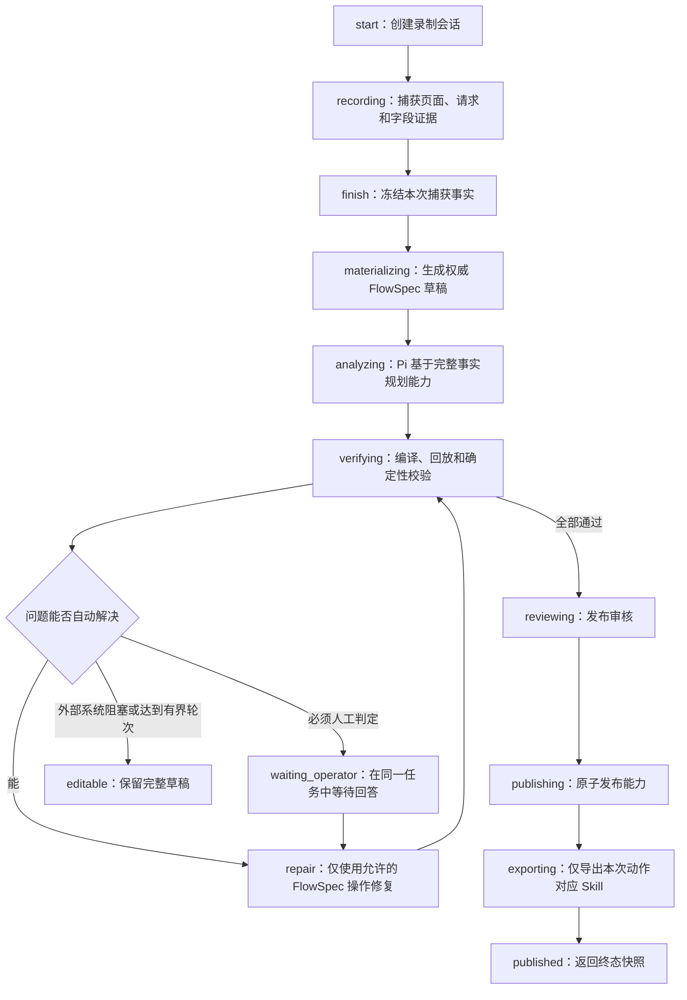

# 录制协议与执行链路

录制功能只有一个公开入口、一个权威状态快照和一个后台任务。浏览器端不再编排分析、验证或发布，也不根据请求数量猜测处理是否完成。

## 唯一主流程

`republish` 从现有权威草稿进入同一条 `analyzing → verifying → reviewing → publishing → exporting` 流水线，不重放已经结束的实时分析记录。

## WebSocket 命令

| 命令 | 发起方 | 作用 |
|---|---|---|
| `start` | 录制准备页 | 创建本次动作、浏览器捕获和工作流。 |
| `input` | 页面录制画面 | 转发指针、滚轮、键盘和文本事件。 |
| `finish` | “停止并分析请求” | 冻结事实并启动唯一后台流水线。重复发送不创建第二个任务。 |
| `patch_draft` | 能力结果页 | 按 revision 和 fingerprint 提交受控差量，不接受客户端完整 FlowSpec。 |
| `republish` | “修改后再次发布” | 对当前草稿运行同一验证与发布流水线。 |
| `answer` | 录制助手 | 回答当前工作流问题，并在同一任务内继续。 |
| `cancel` | “一键终止” | 终止当前分析/验证/发布任务，保留已经冻结的草稿，不退回录制准备。 |
| `ping` | 连接保活 | 不改变业务状态。 |

服务端只发送 `snapshot`、`frame`、`request`、`input_error`、`pong` 和传输级 `error`。其中只有 `snapshot` 能改变前端工作阶段。

## 权威状态

| 状态 | 前端阶段 | 含义 |
|---|---:|---|
| `idle` | 录制准备 | 尚未开始。 |
| `recording` | 页面录制 | 捕获事实；实时 Pi 结论只是工作笔记。 |
| `processing` | 页面录制 | 捕获已冻结，后台正在完成分析、验证、审核或发布。 |
| `waiting_operator` | 页面录制 | 后台任务暂停等待当前问题的回答，助手自动打开。 |
| `editable` | 能力结果 | 自动闭环无法继续但草稿完整保留，可修改后再次发布。 |
| `published` | 能力结果 | 能力已通过闸门并完成本次 Skill 导出。 |
| `cancelled` | 能力结果 | 用户终止了后台任务，已有草稿保留。 |
| `failed` | 能力结果 | 不可恢复的程序错误；错误和草稿同时保留。 |

前端仅在收到 `editable/published/cancelled/failed` 终态快照后进入能力结果页。`frame`、`request`、实时 insight 或中间进度都不能触发阶段跳转。

## 事实、能力与 Skill 的边界

- 页面操作、HAR、请求响应、DOM 字段证据和枚举证据属于录制事实，只有后端持有权威原文。
- FlowSpec 是能力草稿；客户端只接收脱敏投影，只能提交白名单差量。
- capability 是可调用业务能力，不等同于 Skill 包。
- Skill 只在能力通过发布闸门后生成；导出器只接收本次发布返回的 `skill_id`，不得扫描并重新导出其他历史能力。
- 实时 Pi 只提供增量语义笔记。最终发布始终基于冻结后的完整事实重新检查，因此实时展示正确不代表未经验证的结论可以直接发布。

## 已删除协议

以下消息和分支已从前端、公开网关路由和测试契约中物理删除：

`finalize`、`orchestrate_flow`、`auto_fix_flow`、`publish_request`、`flow_update`、`flow_replace`、`refresh_flow_spec`、`request_fields`、`analysis_terminated`、`agent_question`、`verify_progress`。

它们不得通过兼容别名或隐藏分支重新进入运行时。防复活测试会检查唯一 WebSocket 路由、唯一命令集合、旧消息缺席和本次 Skill 定向导出。
