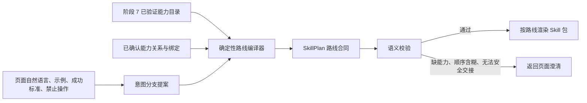

# 阶段 8 Skill 生成优化方案

> 文档用途：交给 Codex 作为后续实施说明。本文只做评估、目标设计、改造拆解和验收定义，不在本次评估中修改后端、前端、测试或现有导出包。
>
> 评估基线：Dano 提交 `ae3aee090dab0f1a8c54a4ae2dad8701d64554ca`，评估日期 2026-08-21。
>
> 核心考核口径：不考核录制出来的业务能力、接口字段或接口语义是否正确；考核生成的 Skill 是否形成了可用手册、明确路由、可执行组合以及真正的渐进披露。

---

## 0. 执行结论

当前阶段 8 **尚未达到最终目的**。

它已经能导出一个文件完整、脚本可引用、Dano 内部校验可通过的 Skill 包，但“页面里的自然语言规划”目前主要被写成说明文字，没有稳定地编译成可执行路由。当前销售订单样本最能说明问题：

- 页面描述包含查询、查看、新增、编辑、审核、反审核、删除之间的办理顺序；
- 导出合同里有 7 个能力，但只有 7 条原子路由；
- `bindings=[]`，`capability_relations=[]`；
- 没有任何带人工交接点的组合路由；
- `SKILL.md` 只有通用操作表和通用 SOP，没有逐条组合方法和完整示例；
- `OPERATIONS.md` 暴露了录制接口链、样本参数和验证状态等生成过程信息；
- 早期文档要求的 `CAPABILITIES.md`、`OPTIONS.md` 没有产出。

因此，现状属于“业务描述里写了组合，导出包里没有可执行组合”。这不是润色问题，必须修改规划合同、路由编译、语义校验和渲染结构。

### 0.1 六项要求的当前判定

| 要求 | 当前判定 | 主要证据 |
|---|---|---|
| 真实参考阿里云 AIOps Skills，并以其格式和方式为最高优先级 | 部分达到 | 已有若干常见章节，但没有采用其最有价值的“先选工作流、再逐步执行、变更确认、成功验证、条件式引用”结构；也没有保留可追溯的参考基线 |
| 把页面自然语言编译为原子、自动串联、人工停问三类可执行约定 | 未达到 | 自然语言只进入摘要/备注；没有确认绑定时，组合路线直接消失 |
| 真实利用 `writing-great-skills` | 未达到 | 主 Skill 过载，引用指针不够具体，长引用没有良好分拆/目录，描述与路由缺少可检查的完成条件 |
| 真实参考指定微信文章并提炼可用原则 | 未形成证据 | 当前仓库没有参考记录，也没有用“适用/不适用、失败、安全、按需加载、命中与误命中评估”等原则形成验收 |
| 早期文档和前端硬要求不丢失 | 未达到 | `CAPABILITIES.md`、`OPTIONS.md` 缯失；生成期指南与成品 Skill 内容边界相互矛盾；高级规划字段没有完整持久化 |
| Skill 不包含代码结构和生成过程信息 | 未达到 | `OPERATIONS.md` 含原始接口链、历史样本值、验证标记等内容，成品更像录制说明书而不是 Agent 执行手册 |

### 0.2 本次改造的唯一主线

把阶段 8 从：

> “根据能力清单生成一份说明文档”

改成：

> “把页面自然语言意图编译成受已验证能力和已确认关系约束的路由合同，再从同一合同渲染出一份可执行、可选择、可停问、可验证的 Skill 手册。”

后续所有改动都必须服务于这条主线，不新建第二套生成器，不手工修补导出包，也不扩展阶段 1—7 的能力发现范围。

---

## 1. 参考源优先级与固定基线

后续实现必须把参考依据写进 Dano 的**内部生成规范**，用于审计“真实参考过什么”；不得把这些参考过程、仓库提交或作者说明复制进最终用户 Skill。

### 1.1 第一优先级：阿里云 AIOps Skills

- 仓库：<https://github.com/aliyun/alibabacloud-aiops-skills/tree/master/skills>
- 本次评估固定提交：`a2497242c16a61b9396f809a22b468f0f1cd8cf9`
- 本次评估检查范围：`skills/` 下 40 个 `SKILL.md`，并重点阅读以下代表性样例：
  - `skills/aiml/agentloop/alibabacloud-agentloop-evaluation/SKILL.md`
  - `skills/aiml/agentloop/alibabacloud-agentloop-dataset/SKILL.md`
  - `skills/analyticscomputing/datahub/alibabacloud-datahub-manage/SKILL.md`
  - `skills/aiml/learn/alibabacloud-pai-workspace-manage/SKILL.md`
  - `skills/aiml/sfm/alibabacloud-bailian-voice-creator/SKILL.md`

#### 应采用的阿里云写法

阿里仓库不是所有 Skill 使用完全相同的固定目录。应采用其中对 Dano 真正有用的共同写法，而不是机械复制某个样例的所有章节：

1. `description` 明确写触发场景和能力边界，让模型能先选中正确 Skill。
2. 在核心流程前先做工作流选择，而不是直接给一串命令。
3. 每条工作流写成有顺序的可执行步骤，并明确步骤之间的数据关系。
4. 变更操作采用“预览/说明影响 → 确认 → 执行”的协议。
5. 每个工作流都有成功验证和失败处理，不把“命令返回了”当成任务完成。
6. 复杂或分支专用材料通过带条件的引用按需加载。
7. 参数、鉴权、清理、可观测性等章节只在真实运行时需要时加入。

#### 不应机械复制的内容

以下章节在阿里样例里是具体产品需要，并非 Dano Skill 的通用硬模板：

- RAM Policy；
- 阿里云 CLI 安装；
- Session ID 或 User-Agent 注入；
- Refresh compatibility；
- 云资源 Cleanup；
- 与当前页面执行器无关的云账号和地域参数。

Dano 只有在实际运行合同需要时才生成对应内容。空章节、占位章节和虚假的“最佳实践”均不得生成。

### 1.2 第二优先级：Matt Pocock `writing-great-skills`

- 用户指定入口：<https://www.skills.sh/mattpocock/skills/writing-great-skills>
- 原始历史版本固定提交：`ed37663cc5fbef691ddfecd080dff42f7e7e350d`
- 说明：该目录在仓库新版本中已更名为 `writing-for-agents`。本项目必须以用户指定的历史版本为基线，同时把新名称作为后续升级提示，不能因为上游改名而声称原参考不存在。

#### 必须落实的写作纪律

1. **可预测性是过程可预测，不是输出字面完全一致。** 同一种意图必须经过同一套路由选择、输入确认、执行和完成验证。
2. **description 是路由入口。** 写“它是什么 + 哪些互不重复的用户请求会触发它”，不要在正文重复身份介绍。
3. **每个步骤都要有可检查的完成条件。** 不能只写“然后处理”“必要时确认”。
4. **常用规则内联，分支专用材料按条件披露。** 指针必须写“何时读取哪个文件/章节”，不能只列文件名。
5. **一个事实只有一个来源。** 合同、字段、选项、路由不得在多个 Markdown 中各维护一份。
6. **只在真实分支值得拆分时拆分。** 不生成大量空引用文件，也不把一条短流程拆成多层跳转。
7. **优先写正向目标。** 例如写“只有确认绑定才能自动带入字段”，而不是堆叠大量否定句；真正的安全红线再保留禁止规则。
8. **模型自动调用时不要写 `disable-model-invocation: false`。** 该字段应省略；只有明确只允许用户手动调用时才使用 `true`，且必须由目标宿主支持。

### 1.3 第三优先级：指定微信文章

- 文章：<https://mp.weixin.qq.com/s/upEf0dCi3qwvpwLkRIwyWA>
- 标题：`我反问面试官：“你一般怎么写skill”...`
- 发布日期：2026-05-22
- 本次读取日期：2026-08-21

#### 应提炼进 Dano 的原则

1. Skill 是可复用能力模块，不是更长的提示词，也不是业务系统说明书。
2. 成品应回答：何时适用、何时不适用、需要什么输入、按什么步骤执行、如何使用工具、输出什么、什么算完成、信息缺失怎么办、工具失败怎么办、安全边界是什么。
3. 工具负责“能做什么动作”，Skill 负责“何时做、怎么组合、做到什么质量”。
4. Skill 是软约束。权限、能力白名单、确认门禁、不可重试等硬安全规则仍必须由运行时和校验器执行，不能只写在 Markdown 里。
5. 上下文需要分层治理：元数据用于选择，主手册用于路由，分支详情按需加载。
6. 需要评估 Skill 命中率、误命中率、路由匹配率、工具调用成功率、人工修正率和上下文成本。
7. 不应把所有资料一次性加载，也不应让过期或重复 Skill 长期共存。

微信文章用于补充“Skill 作为运行手册和上下文治理单元”的原则，不高于阿里样例，也不作为逐字模板。

### 1.4 Dano 本地硬性资料

实现前必须完整阅读并对齐以下本地资料，不能只凭本方案中的摘要改代码：

- `doc/skill-generator-ask-user-question-guide.md`
- `recording-pipeline.md`
- `back/dano/export/skill_package/spec.md`
- 仓库根目录及相关子目录中的 `AGENTS.md`（若存在）
- 阶段 8 前后端当前实现和现有测试

发生冲突时按以下规则处理：

1. 安全和权限硬约束优先；
2. 用户本次明确要求优先；
3. 阿里云样例决定手册、工作流和验证表达方式；
4. `writing-great-skills` 决定路由描述、步骤完成条件和渐进披露纪律；
5. 微信文章用于补足边界、评估和上下文治理；
6. 本地早期要求必须保留其有效行为，但过期的文件布局或互相矛盾的表述需要统一修订，不能把矛盾一起复制进成品。

---

## 2. 当前实现和实际导出包的事实基线

### 2.1 当前页面输入

阶段 8 页面已经具备正确方向的自然语言输入：

- Skill 显示名称；
- 业务描述；
- 动态规划/固定规划；
- 示例请求；
- 成功标准；
- 禁止操作。

业务描述占位文字也已经要求用户说明：用户怎么开口、操作先后、什么时候只查不写、缺什么必须问人、什么结果算完成。

问题不在于页面没有收集自然语言，而在于这些信息没有完整进入路由合同：

- `SkillExportDraft` 只保存 `title`、`description`；
- 页面重新打开后，规划模式、示例请求、成功标准和禁止操作会丢失；
- 页面没有把“哪些组合已成功编译、哪些必须人工确认、哪些无法编译”反馈给用户；
- 生成失败时虽然可显示澄清，但校验器没有把“描述中的组合没有成为路由”视为失败。

### 2.2 当前规划合同

当前 `SkillRoute` 已经包含：

- `route_id`、`name`、`when_to_use`；
- `capability_sequence`、`step_ids`；
- `required_user_inputs`、`bindings`、`preconditions`；
- `requires_confirmation`、`done_when`、`failure_behavior`；
- `examples`。

这说明现有模块不需要推倒重建。但它缺少组合执行最关键的一层：**每一步的输入来自哪里，以及步骤之间没有已确认绑定时在哪里停下来问人。**

当前只在 `usable_relations(spec)` 找到已确认关系时创建 `query_then_write` 等组合路由。没有关系时只写“先查再问”的备注，而不是生成一条带人工交接点的路线。

同时，模型规划提示明确限制模型只能润色文案，不能改变已有路由结构。因此页面自然语言即使清楚描述“先查询，选中一条，再编辑或审核”，也无法补出结构化组合路由。

### 2.3 当前渲染行为

当前渲染器存在四个结构性问题：

1. 多条组合路线的脚本可能被去重后合并进一段通用 SOP，路线边界丢失；
2. 组合摘要只展示顺序和绑定概况，没有逐步输入来源、人工交接点、前置条件、完成条件和失败分支；
3. 示例只存在于合同，未渲染为足以执行的完整示例；
4. 大量字段和选项集中在一个很长的 `INPUT_FORMS.md`，缺少高质量目录或按操作拆分，按需加载效果较弱。

### 2.4 当前销售订单导出包

评估对象：

`export/dano-admin-dianshixinxi-com-90-erp-372468ecf111-package`

当前包含：

- `SKILL.md`；
- `references/CONTRACT.json`；
- `references/INPUT_FORMS.md`；
- `references/OPERATIONS.md`；
- 多个能力脚本。

当前缺少：

- `references/CAPABILITIES.md`；
- `references/OPTIONS.md`；
- 独立的组合路线说明和组合示例。

合同中有查询、详情、编辑、审核、反审核、新增、删除 7 个能力，但：

- 路由全部为原子路由；
- 没有组合路由；
- 没有已确认绑定；
- 没有能力关系；
- 业务描述中的办理顺序只保留为自然语言摘要。

由于没有已确认关系，正确目标不是凭空假设“查询结果的某字段就是所有写操作的目标 ID”，而是生成：

> 查询 → 展示候选并请求用户选定 → 使用用户确认后的目标执行写操作。

只有阶段 7 合同明确确认了字段映射、类型和基数以后，才允许改成：

> 查询 → 自动带入已确认字段 → 执行下一步。

### 2.5 当前校验结果

- Dano 内部文档校验：通过；
- 当前阶段 8 相关回归测试：`49 passed`；
- Codex `skill-creator` 的快速校验：失败，现有 frontmatter 中 `version`、`compatibility` 不被该校验配置接受。

这说明现有测试主要验证“文件存在、文本存在、脚本可引用”，尚未验证“自然语言路线确实被编译为可执行约定”。

---

## 3. 根因分析

### 3.1 自然语言没有成为结构化输入

`business_description`、`example_requests`、`success_criteria` 和 `forbidden_actions` 进入了规划请求，但当前确定性规划器主要依据能力种类和已确认关系构造路线。模型只能改写相同能力序列的文字，不能提出受约束的新序列。

结果是：自然语言可以影响“怎么描述”，不能决定“有哪些路线”。

### 3.2 把“没有自动绑定”误等同为“不能生成组合路线”

自动绑定和组合路线是两个不同概念：

- 组合路线表示用户任务包含多步；
- 自动绑定表示某一步输出可以无需人类判断地进入下一步输入。

没有自动绑定时，组合路线仍然可以存在，只是必须设置人工交接点。当前实现把两者绑死，导致没有关系的多步业务全部退化为原子操作列表。

### 3.3 路由只有全局信息，没有步骤级执行合同

`required_user_inputs`、`bindings`、`done_when` 等目前主要属于整条路线，无法精确表达：

- 第 2 步的哪个字段来自用户；
- 哪个字段来自第 1 步输出；
- 何时展示候选并等待选择；
- 用户取消后是否停止；
- 哪一步变更前需要确认；
- 每一步执行完成的判断是什么。

### 3.4 校验器验证结构合法，不验证意图覆盖

当前校验器能拦截部分非法绑定、缺少确认或脚本不匹配，但没有要求：

- 业务描述和示例中每个明确分支必须对应一条路线；
- 无绑定的依赖步骤必须有人工交接点；
- 每个步骤必须注明输入来源；
- 每条路线必须有成功条件和失败停止规则；
- 无法解释的意图必须返回澄清，而不是静默忽略。

### 3.5 渲染器没有以“路线”为隔离单元

渲染器把多条组合路线的脚本汇总后输出，导致“计划里即使有路线，手册里也可能看不到清晰的逐路线方法”。这违反了阿里样例的工作流结构，也削弱了渐进披露。

---

## 4. 目标语义：原子、串联、停问的可执行判定表

这是阶段 8 的核心业务规则。规划器、校验器、渲染器和测试必须共享这套定义。

| 场景 | 应选择的路线 | 是否可自动串联 | 是否问人 | 写操作确认 |
|---|---|---:|---:|---:|
| 用户只表达一个明确能力 | 原子路线 | 不涉及 | 只问缺少的必要输入 | 有写操作则确认 |
| 用户表达多个互不依赖的操作，且各自输入已经明确 | 显式多步路线 | 可按用户给定顺序执行，但不能跨步猜字段 | 某一步缺输入时停问 | 每个写步骤确认，或提供清晰批量预览后一次确认 |
| 后一步依赖前一步输出，且合同存在已确认绑定 | 绑定组合路线 | 可以，只能使用已确认的字段映射、类型和基数 | 绑定结果为空、多条但要求单条、类型不符或置信不足时停问 | 写步骤前确认 |
| 后一步依赖前一步输出，但合同没有已确认绑定 | 人工交接组合路线 | 不可以 | 前一步完成后展示候选，要求用户选择或补充下一步输入；确认后恢复路线 | 写步骤前确认 |
| 用户描述顺序含糊、分支冲突或能力不存在 | 澄清状态，不生成假路线 | 不可以 | 必须停下来问一个可回答的问题 | 不执行 |
| 只读任务 | 只读路线 | 可按确认关系串联只读步骤 | 缺输入或候选歧义时问 | 不需要变更确认 |
| 写操作返回结果不确定 | 原路线进入未知结果状态 | 不可以重试 | 报告不确定结果并请求人处理 | 禁止静默重试 |
| 用户取消、拒绝确认或候选选择无效 | 路线停止 | 不可以 | 明确报告未执行/已停止 | 不执行后续写入 |

### 4.1 三条不可妥协的硬规则

1. **只有已确认绑定可以自动搬运跨步骤数据。**
2. **没有绑定不等于没有组合；必须用人工交接点表达组合。**
3. **无法编译的明确意图必须变成澄清问题，不能静默降级成原子列表。**

### 4.2 不生成组合爆炸

阶段 8 不应把 N 个能力排列成所有可能组合。只生成以下路线：

1. 用户业务描述明确写出的分支；
2. 示例请求明确表达的分支；
3. 已确认能力关系直接支持、且与用户目标相关的分支；
4. 每个可调用能力的原子后备路线。

不生成“将来可能用到”的排列组合，不硬编码销售订单专属流程，也不为了数量好看生成无触发语句的路线。

---

## 5. 目标规划合同

不新建一套平行规划系统。继续以现有 `SkillPlan` 和 `SkillRoute` 为阶段 8 的稳定接口，在内部增加步骤级合同。

### 5.1 新增步骤级表达

建议在路线中引入单一的 `RouteStep` 概念。它至少表达：

| 字段 | 含义 |
|---|---|
| `step_key` | 路线内稳定、可读的步骤标识 |
| `capability_id` | 只能引用阶段 7 已验证且可调用的能力 |
| `input_sources` | 每个必要输入来自用户、固定值、系统上下文或已确认绑定 |
| `bindings` | 本步骤使用的已确认绑定；不得包含推测映射 |
| `checkpoint` | 需要人工选择/补充时的停点、问题和恢复条件 |
| `confirm_before_execute` | 本步骤是否必须展示影响并确认 |
| `done_when` | 本步骤可检查的完成条件 |
| `on_failure` | 失败、未知结果、空结果和取消时的处理 |

`capability_sequence` 可以作为 `steps` 的派生投影保留给现有消费者，但不能再同时手工维护两份顺序真相。`step_ids` 如果仅用于渲染，应改为由步骤派生，避免顺序漂移。

### 5.2 人工交接点合同

人工交接点至少需要表达：

| 字段 | 含义 |
|---|---|
| `after_step` | 哪一步完成后暂停 |
| `before_step` | 恢复后将执行哪一步 |
| `required_fields` | 下一步仍需确定的业务字段 |
| `prompt` | 面向用户的具体问题，不暴露内部字段结构 |
| `choice_source` | 候选来自上一步结果、动态选项、用户自由输入或其组合 |
| `selection_mode` | 单选、多选、文本、日期等；遵守现有 ask-user 指南 |
| `resume_when` | 什么输入经过验证后可以继续 |
| `on_cancel` | 用户取消时停止并报告未执行 |

人工交接点不是一句“先查再问”的备注，而是能被校验和渲染的路线节点。

### 5.3 路线示例合同

每条多步路线至少有一个完整示例。示例必须包含：

- 用户原话；
- 选择的路线；
- 每一步调用哪个业务能力；
- 关键输入来自哪里；
- 哪些字段自动绑定，或在哪一步问人；
- 变更确认发生在哪里；
- 什么结果算完成；
- 用户取消、候选为空或工具失败时如何停止。

示例中的 ID、姓名、日期、编号必须使用明显占位符，不能复制录制历史中的真实样本值。

---

## 6. 自然语言到路线合同的编译流程

阶段 8 应拆成“受约束提案 + 确定性编译 + 语义校验”，而不是让模型自由生成最终 Skill。



### 6.1 第一步：提取意图分支

模型只负责从自然语言中提出候选分支，不负责发明能力、字段或绑定。每个分支输出：

- 用户触发意图；
- 期望的能力顺序；
- 只读/变更属性；
- 用户表达的前置条件；
- 用户表达的完成结果；
- 仍不明确的地方。

候选能力只能从阶段 7 提供的白名单选择。无法映射的动作必须保留为未解决项。

### 6.2 第二步：确定性编译

对每个候选分支按以下顺序处理：

1. 校验每个能力都存在、可调用且状态允许；
2. 保留用户明确给出的顺序，不擅自调整业务顺序；
3. 判断相邻步骤是否存在数据依赖；
4. 有已确认绑定时，写入精确绑定和输入来源；
5. 无绑定但后一步需要目标时，插入人工交接点；
6. 所有写步骤插入变更确认要求；
7. 为每一步和整条路线生成可检查的完成条件；
8. 无法安全表达时产生 `needs_clarification`，不输出伪路线。

### 6.3 第三步：合并与去重

只在以下内容完全相同时合并路线：

- 能力顺序；
- 步骤输入来源；
- 绑定关系；
- 人工交接点位置；
- 变更确认策略；
- 完成条件语义。

仅触发语句不同可以合并为同一路线的多个示例。能力顺序相同但交接方式不同的路线不能合并。

### 6.4 第四步：结构冻结后的模型职责

路线结构通过确定性校验后，模型只能：

- 改写面向用户的路线名称；
- 精简触发说明；
- 改写提示问题；
- 改写完成条件和失败说明；
- 补充不改变事实的示例措辞。

模型不得：

- 新增未验证能力；
- 新增或改变绑定；
- 改变能力顺序；
- 删除确认门禁；
- 把人工交接改成自动传值；
- 把未知结果改成成功。

---

## 7. 语义校验器必须新增的硬校验

现有格式和脚本引用校验继续保留，并新增以下验收级规则。

### 7.1 意图覆盖

- 业务描述和示例请求中每个明确分支，必须映射到恰好一条路线；
- 无法映射的分支必须列入澄清项；
- 不能存在“文字里有流程、合同里无路线、校验仍通过”的情况；
- 禁止为了通过校验删除无法解释的用户意图。

### 7.2 路线合法性

- 路线只引用已验证、可调用的能力；
- 所有路线步骤顺序稳定；
- 每一步的必要输入都有来源；
- 每一步有可检查的完成条件；
- 多步路线必须有独立示例；
- 不同路线不能在渲染前被脚本去重逻辑合并。

### 7.3 绑定合法性

- 自动绑定只能引用阶段 7 已确认关系；
- 来源选择器、目标字段、类型和基数必须兼容；
- 单值目标收到多候选时不得自行取第一条；
- 绑定结果为空或不完整时进入人工交接或停止；
- 未确认关系只能作为人工候选来源，不能作为自动绑定依据。

### 7.4 人工交接合法性

- 无绑定的依赖步骤必须有交接点；
- 交接问题必须对应下一步缺少的业务输入；
- 控件类型、字段 ID、候选来源和确认回传遵守 `skill-generator-ask-user-question-guide.md`；
- 用户取消或没有有效选择时不得执行下一步；
- 恢复路线前必须重新校验用户选择。

### 7.5 变更和失败安全

- 每个写步骤必须有预览/影响说明和明确确认；
- 只读步骤不能被误标为写入确认；
- 写入结果未知时不得自动重试；
- 删除、审核、反审核等高影响动作必须单独说明影响；
- `forbidden_actions` 必须进入运行合同校验，而不只进入文案。

### 7.6 渐进披露

- 主 `SKILL.md` 只包含选择和执行所需的常用规则；
- 分支专用详情有带条件的直接指针；
- 超过 100 行的引用文件必须有目录，或按真实分支拆分；
- 不允许从 `SKILL.md` 跳到 A、再从 A 才能发现 B 的深层引用链；
- 不允许相同字段表、选项表、路线步骤在多个文件重复维护。

### 7.7 成品纯度

面向 Skill 使用者的 Markdown 中不得出现：

- 阶段 1—8、录制过程、生成器、规划器、渲染器、验证器；
- Python 类名、函数名、源码文件路径、模块结构；
- FlowSpec、指纹、证据 ID、验证批次、`unverified` 等生成内部术语；
- 原始录制请求链、内部接口发现过程；
- 历史请求中的真实订单号、人员、日期、组织或样本字段值；
- “请先阅读 generator-guides”之类只对生成器有意义的指令。

成品允许保留真正执行所需的内容：

- 面向 Agent 的业务路线；
- 公开脚本相对路径和稳定命令入口；
- 业务输入字段、运行时环境变量和鉴权要求；
- 已确认绑定；
- 输出、错误、完成验证和安全边界。

机器审计所需但用户不需要阅读的信息可以留在 `CONTRACT.json` 的专用内部字段中，不能再渲染进业务手册。

---

## 8. 目标 Skill 包结构

新生成包采用以下结构。它保留早期硬性文件，同时让组合路线真正按需披露：

```text
<skill-name>/
├── SKILL.md
├── references/
│   ├── CONTRACT.json
│   ├── CAPABILITIES.md
│   ├── OPTIONS.md
│   ├── INPUT_FORMS.md
│   └── routes/
│       ├── <route-id-1>.md
│       └── <route-id-2>.md
└── scripts/
    └── <verified capability scripts>
```

### 8.1 文件职责

| 文件 | 唯一职责 | 不应包含 |
|---|---|---|
| `SKILL.md` | 触发、适用边界、工作流选择、组合规则、通用执行协议、直接引用入口 | 完整字段表、全部选项、原始接口链、生成过程、所有示例全文 |
| `CONTRACT.json` | 路线、步骤、输入来源、绑定、交接点、确认、完成条件的机器真相 | 面向用户的长篇说明 |
| `CAPABILITIES.md` | 业务能力索引：何时用、读/写属性、输入输出概况、成功结果 | 原始 HTTP、源码结构、历史样本 |
| `OPTIONS.md` | 固定/动态候选来源、何时查询候选、无候选和多候选如何处理 | 重复整份字段表、录制样本候选 |
| `INPUT_FORMS.md` | 按能力索引输入表单、字段校验和 ask-user 规则 | 路由步骤、能力实现过程 |
| `routes/<route-id>.md` | 一条组合路线的逐步方法和完整示例 | 其他路线、全量能力目录、重复公共规则 |
| `scripts/` | 稳定可调用的原子操作 | 规划和路由决策逻辑 |

### 8.2 `OPERATIONS.md` 的处理

当前 `OPERATIONS.md` 同时承担能力目录、调用说明、原始接口证据和执行规则，职责过多且泄露内部信息。

新包不再生成它：

- 业务能力索引进入 `CAPABILITIES.md`；
- 候选规则进入 `OPTIONS.md`；
- 输入规则进入 `INPUT_FORMS.md`；
- 路线执行进入 `routes/`；
- 机器审计事实留在 `CONTRACT.json`。

如果运行时仍需要读取旧包，允许校验器在过渡期兼容旧 `OPERATIONS.md`；但新包不得同时生成 `OPERATIONS.md` 和内容重复的新文件，也不得生成只有一句跳转的空壳文件。

### 8.3 表单文件过长时的处理

`INPUT_FORMS.md` 是早期硬性入口，必须保留。如果实际内容超过合理按需读取范围，则：

- `INPUT_FORMS.md` 保留公共收集规则、目录和能力到表单的直接索引；
- 只有确实很长的能力才拆到 `references/forms/<capability>.md`；
- 拆出的每个表单文件都必须从 `SKILL.md` 或 `INPUT_FORMS.md` 的明确条件指针可到达；
- 不把每个短表单机械拆成一个文件。

---

## 9. 目标 `SKILL.md` 手册结构

阿里云样例决定“先选工作流，再运行工作流”的骨架；`writing-great-skills` 决定内容分层和指针写法。Dano 成品使用以下最小而完整的结构。

### 9.1 Frontmatter

默认只生成可移植的最小字段：

```yaml
---
name: <与目录一致的稳定名称>
description: <它是什么；哪些互不重复的请求会触发；关键边界>
---
```

规则：

- `description` 必须支持模型正确选择 Skill；
- 每个互异触发分支只写一次，不堆同义词；
- 满足目标宿主长度限制，当前 Pi 上限为 1024 字符；项目应设置更小的可测试预算，但不能用没有来源的“必须 30—80 字”替代语义质量；
- `version`、`compatibility` 不再默认写入 frontmatter；运行要求写正文；
- `disable-model-invocation: false` 不生成；
- `allowed-tools` 只有在目标宿主校验明确支持且确实需要时才生成；
- 不为可能存在的其他宿主预先设计复杂 frontmatter 适配层。

### 9.2 正文固定骨架

```text
# <Skill 标题>

## 适用场景
## 不适用场景
## 选择工作流
## 组合与交接规则
## 执行协议
## 成功、失败与停止
## 按需读取资源
```

仅在真实需要时增加：

- 运行环境；
- 鉴权；
- 特殊安全要求；
- 清理或撤销。

### 9.3 “选择工作流”表必须可执行

主表至少展示：

| 用户意图 | 路线 | 步骤顺序 | 跨步数据 | 何时问人 | 确认点 | 完成条件 | 详情 |
|---|---|---|---|---|---|---|---|

要求：

- 原子和组合路线都出现；
- 一行只代表一条路线；
- 不把多条组合路线合并成“依次调用相关脚本”；
- 详情链接直接指向该路线文件；
- 路线没有自动绑定时明确写人工交接，不写模糊的“必要时询问”；
- 不在主表展开全部参数和命令。

### 9.4 “组合与交接规则”必须明确三种模式

1. **原子执行**：单一明确意图时选择一条原子能力；只补齐该能力缺少的输入。
2. **确认绑定串联**：合同明确列出的绑定可以自动带入；出现空值、歧义、类型或基数不匹配立即停止自动串联。
3. **人工交接串联**：没有确认绑定时，先执行前一步，再展示候选或请求下一步必要输入；只有用户选择通过校验后才恢复路线。

### 9.5 “执行协议”采用阿里式步骤和完成条件

建议公共协议：

1. 根据用户原话选择唯一工作流；无法唯一选择时先澄清。
2. 按该行指针读取路线详情和必要输入表单。
3. 收集只在当前路线当前步骤缺少的输入。
4. 按合同处理绑定或人工交接，不猜测跨步字段。
5. 写操作先展示目标、关键字段和影响，获得确认后执行。
6. 按路线完成条件验证结果；失败或结果未知时执行停止规则。
7. 只报告已确认完成的步骤、未执行步骤和需要用户处理的事项。

每一步后必须能判断“已完成/未完成”，不出现没有判定标准的开放式指令。

### 9.6 条件式指针示例

正确：

- “选择‘查询后编辑’路线时，读取 `references/routes/search-then-edit.md`；不要为单次查询加载它。”
- “当前操作缺少必填字段时，读取 `references/INPUT_FORMS.md` 中对应能力的章节。”
- “字段需要动态候选或候选为空/多条时，读取 `references/OPTIONS.md`。”
- “需要判断某个能力的输入输出边界时，读取 `references/CAPABILITIES.md`。”

错误：

- “更多内容见 references”；
- “开始前读取 references 下所有文件”；
- “必须先阅读全部 generator-guides”；
- 只列文件清单，不说明何时需要读取。

---

## 10. 组合路线文件的目标格式

每个 `references/routes/<route-id>.md` 只描述一条真实组合路线。推荐结构如下：

```text
# <路线名称>

## 何时选择
## 前置条件
## 执行步骤
## 输入来源与交接点
## 变更确认
## 完成验证
## 失败与停止
## 完整示例
```

### 10.1 执行步骤表

| 步骤 | 原子能力 | 输入来源 | 执行后检查 | 下一步条件 |
|---|---|---|---|---|

每一步必须使用稳定的业务名称和公开脚本入口，不能写内部 Python 方法或录制节点结构。

### 10.2 已确认绑定示例应表达

- 第一步输出的哪个**业务字段**进入下一步哪个输入；
- 该映射已经由合同确认；
- 允许单值还是多值；
- 为空、超出基数或类型不符时停止自动串联；
- 写入前仍需变更确认。

### 10.3 无绑定人工交接示例应表达

- 第一步只负责取得候选；
- Agent 展示对用户有意义的候选标签，不暴露无意义内部结构；
- 用户必须明确选择，或提供下一步缺少的目标；
- 选择结果经过输入校验后才继续；
- 用户不选、取消或结果为空时停止；
- 不默认第一条，不把搜索条件误当成目标 ID。

### 10.4 示例覆盖的最小种类

整包至少覆盖下列真实存在的类型；不存在的类型不为凑数生成：

- 单次只读原子操作；
- 已提供目标的单次写操作；
- 有已确认绑定的多步路线；
- 无绑定、需要人工选择的多步路线；
- 候选为空或多条导致停问；
- 用户拒绝确认或取消；
- 写入结果未知时停止且不重试。

示例数量由实际路线决定，不设置没有依据的固定 5—8 条指标。要求是每条多步路线至少一个完整示例，关键失败模式至少有一个反例或停止示例。

---

## 11. `CAPABILITIES.md`、`OPTIONS.md` 和 `INPUT_FORMS.md`

### 11.1 `CAPABILITIES.md`

每个能力只提供使用者真正需要的信息：

| 能力 | 何时使用 | 类型 | 必要输入概况 | 关键输出概况 | 完成判断 | 主要风险 |
|---|---|---|---|---|---|---|

要求：

- 使用业务名称，不暴露内部类、源文件、录制节点；
- 清楚区分只读和变更；
- 对写能力说明是否需要详情确认、目标确认或结果回查；
- 不复制全量字段表；
- 不记录“接口是怎么被发现的”。

### 11.2 `OPTIONS.md`

重点不是把录制时见过的所有候选复制出来，而是说明候选如何在运行时获得和处理：

| 字段/用途 | 候选类型 | 来源 | 何时加载 | 空结果 | 多结果 | 用户自定义是否允许 |
|---|---|---|---|---|---|---|

规则：

- 固定枚举可以列出稳定值；
- 动态候选必须说明查询来源和刷新时机；
- 历史录制样本不能伪装成运行时默认值；
- 多结果不能静默选择第一项；
- 运行时来源不可用时，按指南决定自由输入、重试或停止。

### 11.3 `INPUT_FORMS.md`

保留早期 ask-user 指南中的硬要求：

- 按操作分组，只问当前步骤缺少的字段；
- 问题 ID 与合同字段映射稳定；
- 使用正确控件和动态候选；
- 固定值、系统值、运行时可推导值、上一步已确认绑定值不重复询问；
- 校验和转换失败只重问失败字段；
- 用户确认后的值才进入写操作；
- 默认值来自运行时合同，不来自历史样本。

需要修正的旧要求：生成器可以在生成时阅读本地指南，但最终 Skill **不得携带** `references/generator-guides/`，也不得要求使用者先读生成器规范。应保留指南约束产生的行为，不保留生成过程材料。

---

## 12. 前端要求

前端保持非技术化，不增加让用户手工编排节点、字段映射或接口的复杂路线编辑器。

### 12.1 保留一个自然语言规划入口

业务描述继续让用户用自然语言回答：

- 用户通常怎么说；
- 有哪些不同办理分支；
- 每个分支先做什么、后做什么；
- 哪些步骤可以自动衔接；
- 哪些情况必须让用户选择或补充；
- 哪些操作只是查看；
- 哪些操作会修改数据；
- 什么结果算完成；
- 哪些操作绝对不允许。

页面文案不出现 capability ID、binding、selector、target path 等内部术语。

### 12.2 完整保存草稿

`SkillExportDraft` 必须一并保存并恢复：

- `title`；
- `description`；
- `planningMode`；
- `exampleRequests`；
- `successCriteria`；
- `forbiddenActions`。

重新打开同一录制结果时，不得丢失用户已经填写的阶段 8 规划。

### 12.3 展示编译结果，而不是要求用户看合同

导出前或导出失败时，用业务语言展示：

- 已识别的路线名称和步骤；
- 哪些步骤会自动带入；
- 哪些位置会停下来请用户选择；
- 哪些分支尚不明确；
- 需要用户补充的一个或少量具体问题。

如果描述中的组合无法安全编译，页面必须阻止导出并给出可操作澄清。不能“导出成功，但组合只剩一句备注”。

### 12.4 前端不承担安全真相

页面预览只是解释。绑定白名单、写操作确认、禁止重试和能力可调用状态仍由后端合同与运行时强制执行。

---

## 13. 按文件实施清单

以下是后续 Codex 应修改的范围。实施时先读现有代码，再按职责收敛；文件名若在新提交中移动，应以同职责模块为准。

### 13.1 规划模型

文件：`back/dano/onboarding/skill_generation/models.py`

- 为路线增加步骤级合同和人工交接点；
- 让路线顺序只有一个事实来源；
- 保留现有 API 所需的兼容投影，但不长期双写；
- 让示例能表达整条路线，而不是只保存一句用户请求。

### 13.2 路由规划与自然语言编译

文件：`back/dano/onboarding/skill_generation/planner.py`

- 从业务描述和示例中提取受能力白名单约束的意图分支；
- 允许提案选择和排列已验证能力，但不允许提案绑定字段；
- 把无绑定的依赖序列编译成人工交接路线；
- 把已确认关系编译成自动绑定路线；
- 保留原子后备路线；
- 不做全排列；
- 无法解释时生成澄清项；
- 路线冻结后模型只润色，不改变事实。

### 13.3 规划语义校验

文件：`back/dano/onboarding/skill_generation/validate.py`

- 增加意图覆盖、步骤输入来源、人工交接、完成条件、路线示例校验；
- 拦截未确认自动绑定；
- 拦截描述中的明确多步流程被静默原子化；
- 拦截写操作缺确认和未知结果自动重试；
- 将无法通过的项返回为可向用户提问的澄清信息。

### 13.4 Skill 包渲染

文件：`back/dano/export/skill_package/renderer.py`

- 以每条路线为渲染隔离单元，删除跨路线合并脚本的行为；
- 生成精简 `SKILL.md` 路由表和组合规则；
- 生成 `CAPABILITIES.md`、`OPTIONS.md`、`INPUT_FORMS.md`；
- 为真实多步路线生成 `references/routes/<route-id>.md`；
- 不生成新包的 `OPERATIONS.md`；
- 不渲染原始接口链、样本值和生成内部术语；
- 使用直接、带条件的引用指针；
- 长引用增加目录或按真实分支拆分。

### 13.5 包校验

文件：`back/dano/export/skill_package/validator.py`

- 更新新文件布局要求；
- 验证所有路线引用文件存在且一一对应；
- 验证主 Skill 没有深层或无条件加载全部资料；
- 验证禁用的过程词和历史样本没有进入用户 Markdown；
- 验证 frontmatter 满足目标宿主；
- 过渡期只在必要时接受旧包，不要求新包生成重复文件。

### 13.6 生成规范

文件：`back/dano/export/skill_package/spec.md`

- 固定本方案第 1 节的外部参考 URL、提交和采用规则；
- 统一新文件布局；
- 删除“必须把 API 链和未验证标记写进 `OPERATIONS.md`”之类与成品纯度冲突的要求；
- 明确生成期证据与消费期手册的边界；
- 明确三类组合模式和校验不变量。

### 13.7 前端

文件：

- `skillfrontend/src/api/recording.ts`
- `skillfrontend/src/components/PageRecorder.tsx`

改动：

- 完整持久化阶段 8 规划草稿；
- 改进非技术化帮助文字；
- 展示路线编译摘要和人工交接点；
- 无法编译时显示澄清并阻止伪成功；
- 不增加字段映射编辑器或拖拽工作流设计器。

### 13.8 本地文档对齐

文件：

- `doc/skill-generator-ask-user-question-guide.md`
- `recording-pipeline.md`

改动：

- 保留 ask-user 的字段、控件、候选、校验、确认要求；
- 把 `generator-guides` 修正为仅供生成时读取，不进入成品包；
- 统一 `CAPABILITIES.md`、`OPTIONS.md`、`INPUT_FORMS.md` 和路线文件的职责；
- 删除与新规范冲突的旧输出清单；
- 不丢失前端非技术化输入要求。

### 13.9 测试

重点文件：

- `back/tests/test_skill_generation_plan.py`
- `back/tests/test_skill_generation_export.py`
- `back/tests/test_skill_export_cleanup.py`
- 新增或复用销售订单导出回归夹具

不得只修改旧断言让测试变绿；必须先增加能复现当前缺口的失败测试。

---

## 14. 分阶段实施顺序

### 阶段 A：冻结事实基线

1. 固定当前销售订单请求、合同和导出结果为回归夹具；
2. 记录当前 49 条相关测试通过；
3. 增加一条失败断言：业务描述有明确多步分支时，合同必须有组合路线或澄清项；
4. 增加一条失败断言：没有确认绑定的依赖路线必须有人工交接点。

完成条件：能用测试稳定证明当前“有说明、无组合”的问题。

### 阶段 B：先改合同和编译器

1. 引入步骤级输入来源和人工交接点；
2. 实现意图分支提案；
3. 实现受约束的确定性路线编译；
4. 实现意图覆盖和组合合法性校验；
5. 保持原子路线和既有安全门禁回归通过。

完成条件：不看 Markdown，仅检查 `SkillPlan/CONTRACT` 就能回答每个分支何时原子、何时自动串联、何时停问。

### 阶段 C：再改渲染和渐进披露

1. 先按新合同渲染一条路线一个文件；
2. 重写主 `SKILL.md` 为工作流选择手册；
3. 生成早期硬性文件；
4. 移除新包中的 `OPERATIONS.md` 和过程泄露；
5. 添加条件式指针和长文件目录/拆分；
6. 增加完整组合示例和失败示例。

完成条件：不读取 `CONTRACT.json`，Agent 也能从手册选择并执行路线；只执行原子操作时无需加载组合路线全文。

### 阶段 D：前端闭环

1. 保存全部阶段 8 草稿字段；
2. 返回路线编译摘要；
3. 展示自动带入、人工选择和未解决分支；
4. 澄清完成前禁止产生伪成功包。

完成条件：用户关闭并重新打开弹窗后输入不丢；用户能用自然语言确认生成器是否正确理解了组合。

### 阶段 E：文档统一和真实包回归

1. 修订内部规范和早期文档冲突；
2. 从生成器重新生成销售订单包；
3. 禁止手工编辑 `export/...-package` 作为最终修复；
4. 运行后端、前端、包结构、宿主兼容和内容纯度检查；
5. 对比新旧包并记录验收结果。

完成条件：实现、规范、测试和实际导出包使用同一套路线语义。

---

## 15. 必须新增的测试矩阵

### 15.1 规划测试

| 用例 | 必须断言 |
|---|---|
| 单一查询意图 | 只生成对应原子路线，不产生无关组合 |
| 单一写意图且目标已给出 | 原子写路线，写前确认，完成条件存在 |
| 描述“先查再编辑”，无关系 | 生成查询→人工选择→编辑路线，不自动绑定 |
| 描述“先查再编辑”，有确认关系 | 生成绑定路线，映射精确，异常基数进入停问 |
| 多个互不依赖操作 | 保留用户顺序，各步骤输入独立，不猜跨步字段 |
| 描述含未知动作 | 返回澄清，不能静默删掉未知动作 |
| 描述顺序冲突 | 返回澄清，不自行选一个顺序 |
| 只读分支 | 不要求变更确认，不意外进入写路线 |
| 用户禁止某操作 | 该操作不得进入可执行路线 |
| 多条触发语句对应相同合同 | 合并触发示例，不重复路线 |
| N 个能力只描述一条组合 | 只生成该组合和原子后备，不做全排列 |

### 15.2 渲染测试

| 用例 | 必须断言 |
|---|---|
| 两条组合路线 | 生成两个独立路线文件，步骤不串线 |
| 无绑定组合 | 主表和路线文件都明确人工交接点 |
| 有绑定组合 | 只显示合同确认的绑定，不补推测字段 |
| 路线示例 | 包含原话、步骤、输入来源、确认、完成和失败 |
| 早期文件 | `CAPABILITIES.md`、`OPTIONS.md`、`INPUT_FORMS.md` 均存在 |
| 新包纯度 | 不存在 generator-guides、阶段号、源码结构、录制证据和真实样本 |
| 渐进披露 | 主 Skill 有条件式直接指针；长引用有目录或拆分 |
| 单事实来源 | 字段和选项不在多个文件重复全文 |
| Frontmatter | 通过目标宿主校验，不含不支持的默认字段 |

### 15.3 前端测试/构建

- 草稿保存和恢复覆盖全部 6 个规划字段；
- 路线摘要使用业务语言；
- 存在未解决项时禁止导出并显示具体问题；
- 运行 `npm run build`；
- 不引入路线设计器或新的复杂依赖。

### 15.4 实际销售订单回归

对 `dano-admin-dianshixinxi-com-90-erp-372468ecf111-package` 重新生成后至少检查：

1. 7 个原子能力仍存在；
2. 页面明确描述的组合分支各自成为路线，或被明确列为澄清项；
3. 因当前 `capability_relations=[]`，所有依赖查询结果的写路线使用人工交接，不出现虚构自动绑定；
4. 查询、选择、写入、确认和完成验证在路线文件中有明确顺序；
5. 每条多步路线有完整示例；
6. `SKILL.md` 是选择和执行手册，不是接口说明书；
7. `CAPABILITIES.md`、`OPTIONS.md`、`INPUT_FORMS.md` 存在；
8. 新包没有 `generator-guides` 和过程信息；
9. 新包由生成器产生，没有手工回灌修补。

---

## 16. 验证命令和质量门

后续实施至少执行：

```powershell
cd E:\python\try\Dano\back
python -m pytest tests/test_skill_generation_plan.py tests/test_skill_generation_export.py tests/test_skill_export_cleanup.py -q

cd E:\python\try\Dano\skillfrontend
npm run build
```

并对实际重新生成的包执行：

1. Dano 内部 Skill 文档校验；
2. `skill-creator` 快速校验（在该运行环境可用时）：

```powershell
python C:\Users\19419\.codex\skills\.system\skill-creator\scripts\quick_validate.py <重新生成的-skill-目录>
```

3. 过程泄露扫描；
4. 路线文件与合同一一对应扫描；
5. 长文件目录/拆分检查；
6. 新旧包差异审查。

### 16.1 内容评估指标

按照微信文章的评估思想，增加一组不依赖业务接口正确性的 Skill 质量用例：

- 正确 Skill 命中率；
- 错误 Skill 误命中率；
- 用户请求到路线的匹配率；
- 明确分支被静默丢失的数量，目标为 0；
- 非法自动绑定数量，目标为 0；
- 可以自动执行却重复问人的比例；
- 本该停问却继续执行的数量，目标为 0；
- 写操作缺少确认的数量，目标为 0；
- 每条路线完成条件可判定率，目标为 100%；
- 只执行原子路线时加载的无关引用数量，目标为 0。

---

## 17. 明确不做的事情

本轮后续实施不得扩张到以下范围：

- 不重做阶段 1—7；
- 不考核或重写具体业务接口是否发现正确；
- 不改造底层 HTTP 执行器和鉴权体系，除非新合同无法落地且有直接证据；
- 不为所有能力生成笛卡尔积组合；
- 不把销售订单的 ID 映射硬编码进通用生成器；
- 不让模型自由发明绑定；
- 不新增拖拽路线设计器；
- 不复制阿里样例中与 Dano 无关的 RAM、云地域、清理等章节；
- 不把本地 `doc/` 全量塞进成品；
- 不把生成器指南、源码说明或录制证据塞进成品；
- 不手工修改导出包来制造验收通过；
- 不引入第二套规划模型、第二套渲染器或无必要的新依赖。

---

## 18. 最终验收清单

### 18.1 对照用户目标

- [ ] 内部生成规范记录阿里仓库 URL、固定提交、代表样例和实际采用规则；成品采用“选择工作流 → 运行工作流 → 确认 → 验证 → 失败处理”的方式，而不是只模仿标题。
- [ ] 内部规范记录 `writing-great-skills` 历史固定版本，并实际落实 description、可检查步骤、单一事实来源和条件式渐进披露。
- [ ] 内部规范记录微信文章 URL、标题、日期和提炼原则，并建立命中/误命中、路由、人工修正与上下文成本评估。
- [ ] 页面自然语言中的每个明确分支都成为路线或澄清项。
- [ ] Skill 能明确回答何时走原子操作、何时按确认绑定串联、何时在人工交接点停问。
- [ ] 每条多步路线都有完整方法和示例。
- [ ] `CAPABILITIES.md`、`OPTIONS.md`、`INPUT_FORMS.md` 以及前端 ask-user 硬要求保留。
- [ ] 成品不含代码结构、录制过程、生成器指南和历史样本。

### 18.2 对照实际包

- [ ] 主 `SKILL.md` 能在不加载所有引用的情况下完成路线选择。
- [ ] 原子路线不需要读取组合路线文件。
- [ ] 每条组合路线独立渲染，没有跨路线脚本合并。
- [ ] 无确认关系的销售订单组合使用人工交接。
- [ ] 有确认关系的测试夹具只按合同字段自动绑定。
- [ ] 用户取消、候选歧义、空结果和写结果未知都有停止规则。
- [ ] Dano 内部校验和目标宿主校验均通过。
- [ ] 前端构建和阶段 8 回归测试通过。
- [ ] 实际导出包由生成器重新生成，没有手工补文件。

### 18.3 完成定义

只有同时满足以下四句，阶段 8 才算完成：

1. **手册**：Agent 能从主 Skill 判断适用范围、选择路线、按步骤执行并判断完成。
2. **路由**：页面自然语言中的每个明确分支都有结构化路线或明确澄清。
3. **组合**：自动串联只使用已确认绑定；没有绑定的多步流程以人工交接继续，不会消失。
4. **渐进披露**：主手册保持精简，分支资料按具体条件加载，且没有重复真相和生成过程泄露。

---

## 19. 给 Codex 的实施指令

1. 先阅读本方案第 1 节列出的外部参考和本地硬性文档，再检查最新提交；不要直接照抄本文中的旧行号。
2. 先为当前缺口增加失败测试，再修改规划合同；不要先从 Markdown 模板润色开始。
3. 把 `SkillPlan` 作为阶段 8 唯一稳定接口深化，不新建平行生成器。
4. 所有路线事实从合同渲染；禁止分别拼接多份互相漂移的说明。
5. 未确认关系绝不自动绑定；用人工交接点保留用户明确要求的组合。
6. 先让合同能完整回答“原子/绑定/停问”，再渲染阿里式工作流手册。
7. 保留本地 ask-user 和前端硬要求，但移除成品中的 generator-guides 与过程信息。
8. 每完成一个阶段就运行对应测试；最后重新生成实际销售订单包并做结构和内容审查。
9. 不修改或覆盖与阶段 8 无关的用户改动；发现仓库在实施期间前进时，先重新核对差异。
10. 最终交付应包含：改动摘要、测试结果、实际新包路径、六项要求逐项验收表，以及仍需人工决定的事项。
